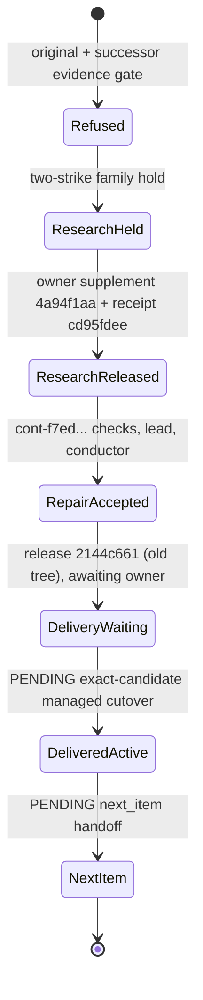

# Durable conductor continuation (implementation record)

Frame: SPEC.md "Accepted primitive integration and final connection batch" (Durable conductor
continuation) and "Conductor continuation SSOT finding" (routing table). Contract:
`docs/contracts.md`, INV-CONTINUATION-001. Base revision 60f79586. This is an implementation
candidate for independent review; it is not deployed, enabled or qualified.

Dated update, 2026-09-24: the sentence above describes base 60f79586 and is kept as history. See
"Operating observation, 2026-09-24" at the end of this file for the current deployed, configured and
qualified state. The whole loop is still not qualified.

## Composition (reuse, not a second engine)

| Stage | Existing owner reused | Added connection |
| --- | --- | --- |
| Policy | Git pin via `GitSource`, strict JSON reader of the approved backlog | `urn:zeus:continuation-policy:1`, `zeus continuation register/identity` |
| Tick | `FleetRunner` optional hook, like the approved backlog | `ZEUS_CONTINUATION_POLICY`, pass after backlog, before admission |
| First item session | `WorkerSessions`, `Executor._run(task_session=...)` | lane `continuation_bindings`, `Operation.claim` attaches it, `execute_one` passes it (`max_handoffs=1`) and freezes the candidate |
| Rejection | executor's committed `review_lead` row, `WorkerSessions.record_review` | correction successor, same frame, `Fleet.enqueue` |
| Evidence refusal | Operation owner handoff | evidence-repair successor, candidate preserved, fresh handoff |
| Two distinct failures | Portfolio investigation (`researched` disposition) | family hold until researched |
| Unknown effects | ExecutionRecovery, termination markers | `recovery_required`, no call |
| Accepted lead | guarded `Executor.decide_one("conductor", expected=...)` | `zeus continuation conduct` as an owned, polled child (`ConductorProcesses`, `ProcessTree`) |
| Release | Releases/ReleaseQueue rows the conductor decision writes | `host_delivery` handoff on the policy target; observes HostDelivery intents |
| Next item | approved backlog (`FleetBacklog`) | `next_item` handoff after `active` delivery |
| Workspace | `GitWorkspace.prepare` pinned base | `continue_workspace` at exact last candidate HEAD, clean, no live/blocked owner |

## Decisions and compatibility

- Successors are new finite operations (`cont-<24 hex>` of the intent id). No parked message is
  revived and no terminal operation row is rewritten. Legacy operations without a binding keep
  their exact row and assignment shape (tested).
- The lane binding, not the manifest, carries lineage: `domain/operation.py` (manifest schema) was
  outside the allowed paths, and the executor re-reads the lane row so a message cannot forge it.
- Evidence repair never resumes a session: the session is still `awaiting_review` with no review
  decision, so resuming it would relabel an unreviewed context. It gets the workspace and explicit
  references instead.
- (Superseded by the correction below.) The first candidate ran the conductor child synchronously
  with `subprocess.run` inside the tick and treated any dispatch exception as `recovery_required`.
- Delivery is a handoff: no production enabling, merge or host switch is performed by this
  controller. HostDelivery remains the owner of publish/merge/switch/rollback.
- `tests/test_operation.py` FakeExecutor now uses a valid 40-hex tree (`"7" * 40`) so the real
  session owner can freeze its candidate; no assertion depended on the old invalid value.

Rollback: unset `ZEUS_CONTINUATION_POLICY` (or register nothing); the runner, finite Operation and
executor paths are then exactly the previous ones. Recorded intents and bindings stay as evidence.

## Consolidated correction (SPEC 2026-09-23, review 7416beb6 of 77dbb04f)

The rejected candidate 77dbb04f is the base of this change and is kept, not recreated. One design:
the continuation is a restartable, nonblocking, identity-bound effect owner.

| Finding | Change | Deciding regressions |
| --- | --- | --- |
| R1 no transition for persisted `intended`/`returned` | `domain.continuation.RESUME`: one action per open (route, state); `_advance` dispatches by it. `intended` conductor resumes through the guard to a launch; `returned` completes from the committed outcome held on the intent (`decision` for the conductor) | `test_every_open_route_state_has_exactly_one_resume_action...`, `test_conductor_restart_after_each_commit...` (intended, dispatched, started-response-lost, returned), `test_successor_restart_after_each_commit...` (intended, published, enqueued-response-lost, returned) |
| R2 delivery chosen by `release_id` only | `bind_delivery`: the one plan of the policy target for the exact release AND accepted candidate revision, cross-checked with the `releases` record; `delivery_binding` tuple on the intent, re-validated each observation; foreign/stale/ambiguous/mismatch are named waits with no write | `test_delivery_is_bound_to_the_policy_target_and_the_exact_release_candidate` (two targets on one release, intended one pending, foreign rollback), `test_bind_delivery_selects_only...` |
| R3 synchronous `subprocess.run` in the Fleet tick | `adapters/continuation_process.py`: `ConductorProcesses.start/poll` over `ProcessTree`; launch identity committed before start; `lock`/`claim`/`exit.json` evidence reconciles without a handle; fenced launches never enter; timeout ends the owned tree; `ContinuationPass` gives the runner `owned/unresolved/drain`; conductors take a `max_parallel` slot, count in the heartbeat and keep stop/`--once` draining; `LaneConductor` removed | `tests/test_continuation_process.py` (real sleeping children: owned poll, restart reconciliation, fence, two owners, spawn failure, timeout, FleetRunner with a second family), `test_runner_counts_a_pending_conductor...` |
| R4 runtime checked only when binding/observing | `_authorize`: registered digest + `check_scope` + stored `authorization` vs current, before every bind/enqueue/start incl. resumed and re-dispatched work; drift records a `hold` once and refuses; reconciliation needs no guard; pin changed/unreadable -> `drain` only | `test_drift_during_an_outage...` (image/profile/archive), `test_conductor_drift_after_an_outage...`, `test_drift_while_the_child_runs...`, `test_changed_runtime_after_a_lost_dispatch_response...` |

Decisions: an exited child whose row is still `pending` attempt 0 may be followed by a NEW launch
identity, bounded by `MAX_LAUNCHES` = 3 (`conductor_launch_exhausted`), because the expected-row
guard - not the launch count - bounds model calls. A drift `hold` is a note on an open intent, not a
terminal `refused`, so the owner restoring the authorized binding resumes the SAME intent; nothing
adopts the changed binding. Intents written by 77dbb04f lack `authorization`/`delivery_binding`: a
new effect of one is held (`authorization_unknown`) and its delivery is a named wait
(`delivery_binding_changed`) rather than a guess; no such rows are known to exist outside tests. POSIX limit (documented in the module): a wrapper killed on its own
releases its lock while the command may still run; its row then stays `running` and becomes recovery
work, never a relaunch. Windows job-object behaviour of these children was not executed here.

## Verification in this batch (worker, Linux container)

Focused files: `tests/test_continuation.py`, `tests/test_continuation_cli.py`, `tests/test_git.py`
plus the directly affected operation, local-cycle, fleet, backlog, monitoring, session and executor
suites; Ruff over the repository. See the worker result for exact commands and counts. Labelled
fixtures: FakeExecutor (worker/lead), ConductorFixture / GuardedDecider (conductor), a fixture
`ProcessTree.spawn` recorder, injected lane/Fleet response loss and `Crash` process deaths at exact
commit boundaries, and controlled sleeping children standing in for the conduct command. Real:
local child processes, locks and launch files of `ConductorProcesses`, MemoryStore flows,
Fleet, Operation, LocalCycle, Workflow, finalization, WorkerSessions archives, Portfolio, temporary
Git repositories.

## Two-strike ownership correction (SPEC 2026-09-23, OWNERSHIP-DEBATE.md option B)

Base aaa4c626. Candidates 77dbb04f and 1bd95a36 were rejected for the same lifecycle family; this
is the debated design, not a third local patch. Reuse/extend, no new scheduler: the Fleet
admission transaction, `ProcessTree`, the launch directory/lock/claim and the continuation intents.

| State (SPEC table) | Where it lives now | Capacity |
| --- | --- | --- |
| Reserved | `Fleet.reserve_unit` (`fleet_units`, same transaction/serialization as `admit_one`) + intent `dispatched` with launch id and token, one commit, before spawn | held |
| Starting | `spawn` marker (one-shot), `launch.json`; guardian `lock`, flushed `debt.json`, then `claim=child` | held |
| Running | hidden DB-free guardian (`continuation_process.main`/`guard`) owns the conduct `ProcessTree`, deadline, stop | held |
| Cleanup pending/unknown | `debt.json: cleanup_unknown`, `unresolved.json`; `observe` -> `unknown`; intent `dispatched` + `hold conductor_cleanup_unknown` | held |
| Cleanup confirmed, settlement pending | `cleanup.json` (parent AND tree confirmed, launch + token); Fleet unit still `reserved` | held |
| Released | `Fleet.settle_unit` checks proof/token and commits the unit release with the intent move | free |

Changed: `domain/fleet.py` (unit rows, `check_unit_proof`, `select_admission(units=)`),
`application/fleet.py` (`reserve_unit`, `settle_unit`, `units`, `held_units`; admission, grant and
relocation count held units; the runner no longer adds a local conductor count and reports
`units_held`), `application/continuation.py` (`_dispatch` reserves+dispatches atomically;
`_settle` releases only on proof; unknown cleanup is held debt; `unresolved` includes held units),
`adapters/continuation_process.py` (guardian, proof-only `observe`, one-shot spawn, `request_stop`;
`available`/`max_active` removed: the port holds no capacity), `domain/continuation.py` (next action
texts), contracts INV-FLEET-001/INV-CONTINUATION-001.

Compatibility: an intent dispatched before this change has a launch without a token; it is settled
without a unit, and its old `exit.json`-only directory now observes as `unknown` (conservative: owner
recovery, never a relaunch). Conductor starts now need a free shared slot and an unpaused fleet.
Rollback: a bare `git revert` is NOT a safe operational rollback, because a predecessor does not count
`fleet_units`. Roll back through the managed host lifecycle, whose activation gate (below) pauses
durable admission and refuses to start a predecessor until every worker reservation and every held
unit is settled on an authoritative read. Retired: the controller-side timeout kill and the local
`max_active` conductor slot.

## Stop and rollback integration correction (SPEC 2026-09-23)

Stop: `FleetRunner.stop()` (the SIGTERM/SIGINT handler and a managed `stop.json`) sets `stopping` and
forwards, before any store access, to `ContinuationPass.request_stop()` ->
`ConductorProcesses.request_stop()`: a local `stop` file per guardian this process spawned, asked
at most once per launch, and forwarded again on every stopping pass BEFORE the DB-dependent drain (a
launch started just before the stop, or a request that failed, is asked again). Ordinary worker
jobs are not signalled. Asking proves nothing: each guardian still writes its own cleanup proof,
and the unit stays held until `drain()` settles it exactly once. The outcome is `stop_request` in
the run summary: `requested` with the launches asked, or `failed` with each launch and error type
(the guardian's own deadline still ends that tree). Pause (`pause.json`, `Fleet.pause`) closes
admission only; stop is the guardian cleanup request.

Rollback (managed host lifecycle, HOST-RUNTIME.md "Activation gate"): every managed start, forward
or restoration, first runs `Fleet.activation_gate` under the target guard - one transaction that
commits the durable admission pause, then a separate one that re-checks it and reads reserving jobs
and held units - before it stops the previous instance and again before it launches. Held debt
refuses `fleet_debt_held`; a failed debt read after the committed pause `fleet_debt_unknown` (the
pause stays); a pause changed between the two `fleet_control_changed`; a pause write/commit that
failed or lost its acknowledgement `fleet_pause_unknown` (no pause is claimed; the retry reconciles
the same hold); a missing authority `fleet_authority_unconfigured`; a dead controller or idle
heartbeat never counts as settled. A restoration waits on these codes (pending) and after its
deadline blocks with the same code, still paused; the recovery owner is ExecutionRecovery / the
host owner: settle each held unit from its proof (drain with unit-aware code) or owner recovery,
then let the delivery retry. The pause is retained after activation as an `activation_hold` naming
the descriptor; only a runtime running exactly that descriptor releases it (a unit-aware runtime);
a predecessor that predates this stays paused until the owner decides `zeus fleet resume`.

Decisions: a reconciler that wins the lock before a freshly spawned guardian fences it (the guardian
exits `3` with zero conduct; the unit is released on the fence and a new identity may follow within
`MAX_LAUNCHES`). Graceful stop keeps the R3 drain; guardians additionally honour a local stop request
(`stop` file, POSIX SIGTERM) and still prove cleanup. A guardian that cannot confirm cleanup exits
`124` after bounded attempts with the deliberate handoff; on Windows its exit closes the job handle
(kill-on-close), which is still not recorded as proof. On Windows the guardian requests
`CREATE_BREAKAWAY_FROM_JOB`; if the controller's job forbids it the single fallback spawn keeps it in
that job (`breakaway: False`) and controller teardown then leaves unknown debt.

## Not established here (owner qualification gates)

- The ownership correction on Windows (job object, breakaway, guardian survival of controller
  teardown) and PostgreSQL advisory-lock concurrency of `reserve_unit`/`admit_one`: only POSIX
  process groups and MemoryStore thread concurrency were executed in the worker image.
- Real PostgreSQL lane schemas and Redis delivery; the conductor's Redis stream message is handled
  from the operation's outbox row and stays unacknowledged in the stream (idempotent by inbox hash).
- A real two-turn model session through the isolated worker and the correction resume.
- A managed Fleet run with the policy enabled, actual HostDelivery consumption/rollback, and two
  useful unattended jobs.
- Native Windows execution of these tests.

## Operating observation, 2026-09-24 (SPEC Item A-current)

This section restates the owner facts in SPEC.md "Current-source useful-item qualification after
actual repair". It runs nothing new. The list above is kept as it was written. The rows below say
which of its gates have since been observed on the operating runtime.

Deployed code: PR191 at f2b392d9, including PR190. It was consumed by the scheduled Fleet on image
1ee94821. Release 2144c661 names the old b31a9112 / tree 52b232ab. It is awaiting the owner for
zeus-fleet-managed and is not the current deployment. The policy file bound to the running service
is not restated in the owner facts.

| Route stage (table above) | Observed on the operating runtime | Still pending |
| --- | --- | --- |
| Evidence refusal -> successor | original 1fa1026d and successor 4dde540d refused; rows retained | - |
| Two distinct failures -> research hold | family held; council003 accepted, with seven settled starts | - |
| Research completion | owner scope supplement 4a94f1aa + receipt cd95fdee released exactly this pair; no other family | - |
| Evidence-repair successor | cont-f7ed34f73b048bd5b698b3bb passed its declared container checks | - |
| Accepted lead -> conductor | independent lead and conductor accepted; Fleet finalized accepted, no held units | - |
| Release / `host_delivery` handoff | release 2144c661 for the old tree is awaiting the owner | exact-candidate managed cutover, canary, rollback |
| Next item | not observed | `next_item` after an `active` delivery (B-current) |
| Rejection -> same-session correction | not observed in this family | a real rejection; none may be forced |
| Stop / restart / duplicate tick | not observed on the operating runtime | duplicate/restart control with no second invocation |

States up to DeliveryWaiting have been observed. States marked PENDING have not. The CI attempt 1
wall-time failure on Windows 3.12 has an unconfirmed cause (see STATUS.md). The operator checklist
for the remaining gates is in [STATUS.md](STATUS.md) "Current checkpoint: 2026-09-24 11:52 UTC".
