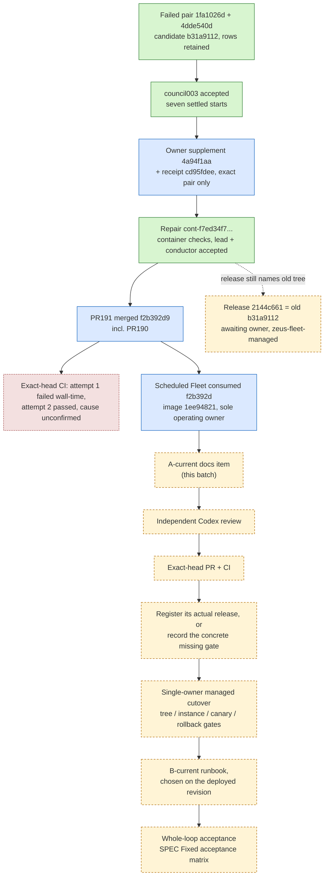

# Operating status

## Current checkpoint: 2026-09-24 11:52 UTC (owner facts, SPEC Item A-current)

Whole autonomous operation is NOT accepted. This checkpoint restates the owner facts recorded in
SPEC.md "Current-source useful-item qualification after actual repair, 2026-09-24"; it adds no new
execution. Every dated section below stays as the evidence of its own time. The heading
"Current checkpoint: 2026-09-23 13:00 KST" below is now historical, and its image ae070306 is not
the current operating image.

Three layers are kept apart:

| Layer | State at this checkpoint | Source |
| --- | --- | --- |
| Deployed code | PR191 ([#191](https://github.com/trevi00/zeus/pull/191)) merged at f2b392d9d1e770878699be88699872a143a26351, including PR190's ([#190](https://github.com/trevi00/zeus/pull/190)) project inheritance / scope supplement. The scheduled Fleet consumed that revision on image 1ee94821, with its active module path in runtime-delivery-tree. Previous deployment: PR189 ([#189](https://github.com/trevi00/zeus/pull/189)) at 131cb262. | owner facts, SPEC |
| Configured policy / release | The scheduled Fleet is the sole operating owner. Release 2144c661 names the OLD candidate b31a9112 / tree 52b232ab and is awaiting the owner for target zeus-fleet-managed. It is NOT the current deployment: the scheduled cutover used integrated f2b392d, not that release. The exact continuation policy content in the running service is not restated in the owner facts (unknown here). | owner facts, SPEC |
| Actual qualification | One real failed family recovered end to end, up to candidate acceptance (below). Managed exact-candidate cutover, canary, rollback, duplicate/restart control and a second useful item have not been observed. | owner facts, SPEC |

Observed, with each actor named:

- Failure history (unchanged): original task 1fa1026d and automatic successor 4dde540d both
  failed the evidence gate for candidate b31a9112 / tree 52b232ab (SPEC "Two-strike investigation").
  The original failure rows are retained. Nothing was rewritten as success.
- Research (Fleet model run): actual council003 was accepted, with seven settled starts.
- Owner actions: the explicit append-only scope supplement 4a94f1aa and receipt cd95fdee released
  exactly the two-attempt delivery-tree family. No other held family was released. The SPEC records
  the coverage attestation as the owner's semantic judgment, not a model verdict.
- Repair (Fleet model run plus independent review): successor cont-f7ed34f73b048bd5b698b3bb passed
  its declared container checks, then independent lead and conductor acceptance. The Fleet finalized
  it as accepted, with no held execution units.
- Delivery of code (owner action): PR191 was merged, and the scheduled Fleet consumed it as above.
- CI: exact-head attempt 1 failed on Windows 3.12 in two unchanged guardian wall-time assertions
  (2.234s vs 2s; 2.547s vs 1s). The same-head attempt 2 passed, and two local targeted tests passed.
  The cause of the attempt 1 failure is **unconfirmed**. The second attempt passing does not explain it.

Legend: green = observed; blue = owner action (observed); amber dashed = pending; red dashed =
observed result with an unconfirmed cause. Arrows show order, not automation. Only the steps
labelled as model runs above were done by Fleet workers or reviewers.

Unknowns stated honestly:

- The cause of the Windows 3.12 guardian wall-time failure in CI attempt 1.
- Whether release 2144c661 will be delivered, superseded by a reviewed successor lineage, or left
  waiting. It remains an honest awaiting-owner record either way.
- The merge revision of PR190 is not in the owner facts; only its inclusion in f2b392d is stated.
- Nobody has yet observed whether the managed target can take over from the scheduled Fleet with no
  second active Fleet, or whether a rollback of an exact candidate restores the predecessor.
- The continuation `next_item` handoff after an `active` delivery has never been observed.

Remaining operator checklist (the owner fills each evidence column; nothing below has been run by
this batch):

| # | Step | Gate that must hold | Evidence to record |
| --- | --- | --- | --- |
| 1 | Independent review of this A-current candidate | exact document facts, diagram and scope | review id / verdict |
| 2 | Exact-head PR and CI | all required checks on that head; a failure is recorded, not rerun until green | PR number, run id, head |
| 3 | Register the actual release of that head for zeus-fleet-managed, or record the concrete missing gate | exact Git tree identity and candidate binding ([HOST-DELIVERY.md](HOST-DELIVERY.md)) | release id, tree, or the named gate |
| 4 | Single-owner managed cutover | pause admission; no reserving jobs or held units; old launcher preserved; scheduled owner stopped before the managed start; no second active Fleet ([HOST-RUNTIME.md](HOST-RUNTIME.md) "Activation gate") | receipt with loaded module path, revision, PID, admission restored |
| 5 | Canary and rollback | canary bound to the exact release; rollback through the managed lifecycle, never a bare `git revert` ([CONTINUATION.md](CONTINUATION.md) "Two-strike ownership correction") | canary result, rollback receipt |
| 6 | Duplicate/restart control | a duplicate tick or restart creates no second invocation; unknown effects stay as held debt | intent / unit ids before and after |
| 7 | Second useful item | B-current runbook selected automatically from the approved backlog on the deployed revision | admission intent, job id, review result |
| 8 | Keep the old records | release 2144c661 and the held families are kept as they are, not relabelled | unchanged row reference |

Links: [SPEC.md](SPEC.md) (owner facts and "Fixed acceptance matrix"), [CONTINUATION.md](CONTINUATION.md),
[HOST-DELIVERY.md](HOST-DELIVERY.md), [HOST-RUNTIME.md](HOST-RUNTIME.md), [RUNBOOK.md](RUNBOOK.md),
[WORKER-SESSIONS.md](WORKER-SESSIONS.md). The raw owner evidence named in SPEC (Fleet/PG rows,
receipts, CI runs) lives in owner artifact stores. This batch names it but did not execute or re-read it.

## Evidence recovery checkpoint: 2026-09-23 14:04 KST

PR182 merged at 04:27:48Z (ce81f885); no live deployment was attempted. Session correction 973a903f
passed its lane's independent review; real session/container owner qualification remains pending.
Managed-runtime candidate 344271b9 finished implementation but stopped at evidence inspection:
seven checked commands, one whole-suite replay timed out at 300s. Its output also had setup errors.
Owner isolated replay of the first affected test file established missing ssh-keygen in the pinned
verifier image. It does not establish all full-suite errors or a managed-runtime defect.

Same SPEC now fixes the recovery scope: preserve failed/uncompleted full-suite history; submit
completed, originally required focused checks; independently review the inherited runtime as a
whole. Plan 98bbae773d203b34082eeb9e5586eb8f61e475a2 was registered and Fleet actually dispatched
autonomous-operation-001-host-runtime-evidence at 05:03:52Z; task is running. No gate, timeout,
production image or old inspection was weakened/rewritten. This remains owner-directed recovery,
not proof that autonomous diagnosis/continuation has been delivered.

## Continuation checkpoint: 2026-09-23 13:17 KST

Session correction remains an actual running harness-lane job. The interface lane additionally
admitted autonomous-operation-001-host-runtime at 04:12:46Z from owner plan
6ee10bc4c99e5ade0498e39a48f899eb286abc56. It implements the missing managed immutable runtime /
actual Fleet entry / pause-drain-heartbeat / predecessor consumption composition specified in the
same SPEC. Paths are disjoint from session correction; neither job may change production services.

PR182 owner review comment 5788869558 records no additional established blocker in the fixed
inherited instance-ownership scope, conditional on exact-head CI. Linux 3.12/3.14 checks passed;
Windows and integration were still running. An owner-authored bounded continuation is actually
waiting for run 35816837876 on head aff7749882 and unchanged base c9e7ed19. It requires all six
named checks plus workflow success, then marks ready and merges with the exact head guard. It
does not deploy or invoke models. Failure/identity changes stop and are recorded; there is no CI
rerun loop. This bootstrap owner action is not the still-pending autonomous conductor.
Evidence: artifacts/autonomous-operation-001/host-pr-continuation.json(l), finish-host-pr.py.

SPEC now also records the existing Council/Operation/Executor/Release continuation routing and
the requirement to preserve the original managed workspace for native correction continuity.
Implementation of that controller follows acceptance of the session primitive; the whole-loop
recovery, rollback and two-useful-item gates remain open.

## Latest execution checkpoint

- Native correction aff7749882 passed the independent review of its two-file delta. Owner native
  Windows four-file rerun completed: 143 passed, 1 integration skip (native-fixed.log). The
  preceding candidate's isolated-PG check passed separately; no later runtime change in this delta.
- Draft PR182: https://github.com/trevi00/zeus/pull/182, head aff7749882. CI and actual deployment
  qualification are pending. Draft publishing is not merge, deployment or whole-feature acceptance.
- Session candidate ecb0e6d6 stopped at evidence gate: six checks replayed, five timeout-prefixed
  commands were not authorized for replay. No mismatch was reported by that gate. Owner Windows
  ten-file replay: 226 passed, 29 skipped, four failed. See session-owner-tests.log.
- Owner reproduced absent-promotion closure and duplicate-owner model-check bypass in temporary
  MemoryStore only, then consolidated them with required observability/native evidence completion
  in the SAME SPEC. Source implementation is preserved, not approved or deployed.
- Plan d4e8cc2c83ce15786354c51e8375affcd43b3f6e is registered. Actual Fleet job
  autonomous-operation-001-session-correction is running on the harness lane using Opus 5.5.
  This is an owner-designed correction, not proof of the future autonomous diagnosis controller.

Next: accept and qualify the session primitive, connect bounded automatic continuation to existing
review/research/release owners, then execute all seven whole-loop acceptance criteria. No new user
approval is needed for this already-authorized scope. Ordinary completion claims must continue to
distinguish actual worker activity, accepted code, live consumption and the complete autonomous loop.

## Current checkpoint: 2026-09-23 13:00 KST

Whole autonomous operation is NOT yet accepted. Fleet is running, and actual pinned Claude Opus
5.5 jobs are executing on harness and interface lanes. The active image is
sha256:ae070306fb25ccc37d41a73cd0ab0a2b5fdafcfff3914161518918c1932b79c6 (CLI 2.1.280).
Older dated statements below describe their own checkpoint, not this current image.

| Remaining outcome | Current evidence / next action |
| --- | --- |
| Worker context through review and correction | worker-sessions dispatched 03:27:57Z; actual native two-turn transport probe passed, Zeus lifecycle implementation/review pending |
| Qualified operating delivery and rollback | instance fixture archive 119 passed/25 skipped; named regression passed; inherited runtime review and native-evidence job pending |
| Automatic diagnosis, correction and release continuation | SSOT traced in SPEC; connect accepted session API to finite-operation successors and existing Releases authority |
| Whole autonomous acceptance | two useful items, controlled recovery, rollback/restart and traceable monitor outcome remain unexecuted as one unattended chain |

Plan 8ddad09d7740095dea9f5a8f2fbf47bd3065cc05 admitted native-evidence automatically at 03:52:15Z.
Both active jobs use Claude implementation followed by independent Codex review. This owner-written
plan is explicit owner orchestration, not evidence of autonomous correction design.

Owner additionally executed candidate 779d0326's isolated PostgreSQL transaction test on Windows:
1 passed, 0 skipped in 8.07s, using its clean candidate checkout and fixture-owned temporary schema.
Log: artifacts/autonomous-operation-001/instance-replay/pg-candidate.log. The initial attempt from
the integration branch worktree skipped because runtime_revision does not follow Git commondir
for symbolic refs; pg-owner.log preserves that skip. Deploy qualification uses an exact detached
commit or explicit owner attestation. Symbolic-worktree lookup support is a follow-up limitation,
not evidence that a skipped case passed or a reason to disable revision matching.

Native scope before the test portability correction: 141 passed, 1 skipped, 1 failed, 1 deselected.
The deselected test self-terminates pytest on Windows; the failure conflates venv launcher and
interpreter PID. Both are in one pinned correction. No host-delivery candidate is deployed yet.

## Historical checkpoint: 2026-09-22

PR 179 merged as aba7a894b69cdd72d2f2ef585efe17ccda0b5a6a.
PR 180 merged as 980cd3017b70742f34009fae15f97e11d9697d4f after all required CI passed.
Owner Windows/disposable-PG checks for the combined runtime: 203 passed, 9 skipped; Ruff passed.
Skipped cases are not execution evidence.

At 2026-09-22T14:56:27Z the restarted Fleet process recorded loading application/fleet.py from
C:/workspaces/zeus/worktrees/runtime-autonomous-001 at tested revision
db859af87845d8679e7fc03219e9ae4580bd0a3e. Admission was paused, zero active/queued jobs confirmed,
the old scheduled process tree stopped and disappeared, and only then the owner root was switched.
The new startup recorded its loaded module path; revision is bound by the owner's clean-tree
preflight, not inferred from a model answer. Admission was restored to unpaused.

Worker image remains sha256:df85b10cdfb4e744e81d466d6ed747e6f9ee1398b29f01dab456989e9c635cfa.
No claim that the container image was rebuilt or that candidate host code is inside that image.
Authentication and lane configuration were unchanged. Existing owner/entry/launcher backups and
hashes, old process IDs, consumed-path receipt and result are retained under
C:/workspaces/zeus/artifacts/autonomous-operation-001/cutover/.

Remaining whole-frame gates: register meaningful approved backlog work and prove automatic next
selection; connect qualified research/failure candidates and recovery; implement/verify automatic
release consumption and rollback; run the finite whole-loop acceptance checklist in SPEC.md.
There was no registered backlog plan at cutover. A running service with zero jobs is not evidence
of ongoing useful work or complete autonomous operation. This cutover is owner-operated evidence,
not proof of automatic deployment or a tested rollback.

## First automatic admission, 2026-09-23 KST

Owner registered enabled plan autonomous-operation-001 at Git pin 82284fafa1ff608ce99f7164d0e77fb3fe57a803
and enabled ZEUS_FLEET_BACKLOG_PLAN in the existing owned launcher. After a drained restart and
resume, the runner created autonomous-operation-001-backlog-monitor at 2026-09-22T15:00:09Z,
bound it to research-improvement / verified-loop, and dispatched it. No manual Fleet.enqueue or
manual backlog.tick was used. The intent reports linked, zero deferrals, no binding conflict.
Receipt: artifacts/autonomous-operation-001/first-automatic-admission.json on the current C workspace.

The useful item adds the missing read-only backlog source to monitoring; implementation and review
were still pending when this receipt was recorded. The plan has one item, so backlog_exhausted means
no unadmitted item remains, not that the dispatched job finished. This proves first-item selection
and admission, not automatic successor selection, self-generated work, recovery or release.

## Accepted monitor correction and bounded delivery continuation

Correction e91deeb1 passed independent review after the first evidence-gate refusal. Owner integrated
it at e51c1e20875363dd95ebac1d802e222aad43a71f and ran monitoring/observation tests on Windows:
30 passed, Ruff passed. PR181 contains this integrated head. Initial actual /api/status inspection
showed no fleet_backlog source: the running monitor collector still uses runtime-176.

To avoid another idle handoff, an owner-authored one-shot continuation runs under
artifacts/autonomous-operation-001/monitor-cutover/finish.py. It is pinned to PR181, head e51c1e2,
and workflow run 35794784993. It waits at most 45 minutes, requires all seven named mandatory jobs
and workflow success on that head, checks a clean pinned runtime and unchanged launcher, then
merges that PR and switches ONLY the monitor collector. A fresh /api/status must show the actual
backlog plan. Failed activation restores the saved launcher and restarts the old collector;
changed/ambiguous ownership stops rather than overwriting. No automatic test reruns or model calls.
The web service and Fleet service are unchanged. Logs/results remain in that cutover directory.

At startup the helper recorded waiting_ci (2026-09-22T22:56:51Z). Syntax and pinned CI identity were
checked; activation/rollback are not yet exercised or claimed successful. This authorized one-shot
administrative continuation is not the reusable release controller required by the whole frame.
# 2026-09-23 correction dispatch checkpoint

The monitor continuation completed with PR181 merged and collector consumption verified (receipt:
artifacts/autonomous-operation-001/monitor-cutover/continuation-result.json). Operating Fleet code
is unchanged. Rejected candidate 9689ed9 is present only in the implementation checkout.

The consolidated seven-finding correction is pinned by plan be5524ea9ce07736fd2ef73beef42f1ffe36578f.
Primary PostgreSQL records autonomous-operation-001-delivery-correction as dispatching at
2026-09-23T00:51:46.272747+00:00 in the harness lane. Registration/admission evidence is under
artifacts/autonomous-operation-001/delivery-correction-*.json. This proves automatic admission
of an owner-authored correction, not completed Claude execution or autonomous diagnosis.

Independent review, affected verification, CI and qualified host consumption remain required.
The master SPEC records the durable rejection-to-successor coordinator boundary; implementation
and real no-chat continuation qualification of that separate path remain pending.
# Whole-goal checkpoint, 2026-09-23 12:34 KST

Owner continues toward the existing full autonomous-loop completion contract without manual user
relay for routine steps. This checkpoint supersedes earlier per-job summaries, not their evidence.

| Area | Actual state | Completion still required |
| --- | --- | --- |
| Approved backlog/Fleet admission | Accepted, deployed; two disjoint lanes now running | Goal-backed self-selection after research, not only owner-pinned items |
| Backlog monitor | PR181 deployed and real source verified | New session/continuation/release stages with evidence links |
| Opus 5.5 | Actual model probe passed; Fleet consumed image ae070306 at 03:27:51Z | First full worker result/model binding and subsequent normal use |
| Native CLI session continuity | Two actual Opus 5.5 turns in removed/recreated containers retained session id and remembered nonce | Zeus-owned secure archive, task/review binding, concurrency/restart/closure qualification |
| Worker-session implementation | Opus 5.5 Claude running in harness lane | Independent acceptance, integration and real two-turn Zeus qualification |
| Host delivery | Instance correction a1481784 produced, NOT accepted; verifier fixture mismatch reproduced | Parallel interface-lane fixture repair, independent whole changed-boundary review, PG/Windows/CI and actual host/rollback qualification |
| Conductor continuation | Existing rework message path traced; finite Operation currently stops and parks it | Qualified ongoing lifecycle using existing owners and accepted session API |
| Research/recovery/release loop | Components and authority exist, connections incomplete | SSOT/Council selection, two-strike research, safe recovery, exact reviewed deployment and next item |
| Whole unattended acceptance | NOT complete | Two useful items, recovery, rejected/rollback control, duplicate/service restart and parallel progress without chat relay |

Native CLI resume probe evidence: artifacts/autonomous-operation-001/opus55/native-resume-receipt.json.
It uses a dedicated test-only CLI home; it does not prove the future Zeus allowlisted archive path.
Raw model usage is retained. No reboot, live product/payment rollout or complete asset absorption
is required to close this initial autonomy contract. These remain operating workload/product gates.
# Owner qualification checkpoint, 2026-09-23

Accepted session 973a903f and managed-runtime 9c327f48 are integrated at a81cfbd. Windows scoped
integration: 226 passed, 11 skipped, 1 test-oracle failure. CRLF/raw-byte versus Git-filtered hash
was reproduced; no corrupt runtime was observed. Ruff passed. Native qualification support and
the durable conductor connection are dispatched through approved backlog pin 752462d, both actual
Claude tasks observed running. No operating runtime or live worker image has been switched.

Owner built image sha256:f1b6ef24d6ae27a1885442c269618c783fe2604c67eaccde375dd19f6d0525fe
from the pinned implementation. Real Opus 5.5 transport made two calls with separate removed and
recreated containers, the same session id, verified archive prefix continuity and successful
nonce recall. Checkpoints were committed in dedicated PostgreSQL schema
zeus_session_qualification_001. Both containers were removed with evidence retained. This proves
transport/PG/archive resume, not the future continuation controller's independent review cycle.
Receipt: artifacts/autonomous-operation-001/session-real-receipt.json (raw turns retained locally).

Resumed usage delta remains explicitly unknown: cache_creation_input_tokens decreased from 2929
to 172 while cache_read_input_tokens became 2929. No zero/delta was invented; original usage is
preserved. Primary documentation read 2026-09-23:
https://code.claude.com/docs/en/agent-sdk/cost-tracking distinguishes per-turn usage, per-model
totals and cumulative cost, with differences between input modes. These actual CLI 2.1.280
observations do not establish universal cumulative raw-usage semantics. Calibrate attribution
against the pinned transport before claiming token efficiency; retained raw usage remains evidence.

Owner also launched the REAL managed Fleet on Windows, with a dedicated empty PostgreSQL schema
zeus_managed_qualification_001. Its startup receipt identified sealed source 752462d and actual
module path; fresh heartbeat reported zero active/unresolved work. Repeated start reconciled the
same instance and graceful stop succeeded. Receipt: artifacts/autonomous-operation-001/
managed-real-receipt.json. No model call, operating-queue admission or live service mutation occurred.
This is actual Windows managed Fleet consumption, not useful-work/live cutover/rollback evidence.

Remaining: accepted native-platform correction; independently accepted connected controller;
actual rejected-review session correction and release/canary/rollback; two useful items selected
and completed without chat relay, including recovery/restart/fairness and monitoring evidence.
