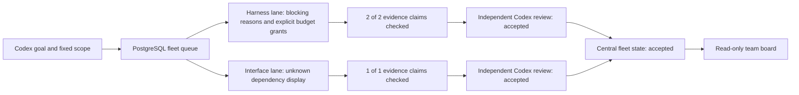

# Fleet 001 result

Two real operations completed through the reusable fleet dispatcher, including Claude implementation,
evidence inspection and independent Codex review. The central PostgreSQL projection records both as
accepted. Acceptance here is candidate-review acceptance; owner release follows the integrated checks.

The two actual container execution intervals overlapped for at least126.31 seconds. Per-lane Redis
namespaces, PG schemas, runtime roots and task IDs are separate; machine CallBudget remains shared.
No automatic retry, model-generated backlog, merge or deploy occurred inside either operation.

| Actual operation | Candidate | Result |
|---|---|---|
| fleet-001-fix-backend | f18956c5801d3de5c73e8fe985f3d325059c86e4 | accepted;2 calls;36 focused tests plus Ruff |
| fleet-001-fix-ui | 4081cb82042a2ddd174130f9ea8eb587e6475190 | accepted;2 calls;Ruff;owner TypeScript/build/lint/browser |

The initial implementation operations were review-rejected for two P2 visibility defects and remain
rejected in their original schemas/evidence. Their provisional code was integrated only on the task
branch. The two already-budgeted live jobs supplied the corrections; no extra model round was added.
Total delivery:8 counted calls (4 initial implementation/review +4 actual fleet correction/review),
ledger152->160, no unreadable slots. The fleet is paused after the drain; neither job needs recovery.
The exact-token scan of delivery/lane artifacts found0 hits and0 unreadable files. Four terminal
collectors each inserted their remaining2 events, with0 sink failures/conflicts/corrupt/refused records.

## What changed

- First-class register/enqueue/run/pause/resume/status CLI over existing PG/Operation/Redis authority.
- Transactional admission: duplicate protection, capacity, lane ownership, repository path conflicts,
  explicit prerequisites and fixed machine budgets. Unknown ownership remains reserved across restart.
- Durable observed waiting reasons, without moving timestamps on unchanged polls.
- Explicit operator budget renewal under the trusted local CLI boundary: idle gate, expected-total check, immutable
  grant history, preserved registration/historical manifests and pause; no automatic authority increase.
- Optional fleet snapshot and Korean team board: conceptual path, teams, real states, criteria,
  dependencies, call counts, truncation and freshness. Unknown is not failure or zero. Existing fixed
  report denominators and read-only web boundary stay unchanged. See [RUNBOOK](RUNBOOK.md).

## Independent owner verification

Actual isolated PostgreSQL17.11 checks:8 admission racers claim only2 slots;6 identical enqueues create
one job; new instances retain reservations; pause persists; unknown retains ownership; wrong/missing
receipts cannot become accepted.8 simultaneous budget grants commit only one, preserve original
registration and pause, require new ceilings for new jobs, and refuse queued/dispatching/unknown work.
Waiting reasons survive the read-only projection; unchanged polls preserve timestamps. These use
synthetic job/grant rows in disposable schemas, not claimed model executions. Temporary schemas were
removed; actual fleet grants and machine budget were untouched by these checks.

Owner frontend checks: TypeScript/Vite build and ESLint pass. Browser verifies actual central fleet
records;390px width equals390px document width; dark mode and existing report/six detail disclosures
render. Explicit synthetic envelopes exercise missing prerequisites, unknown ownership/null counts,
unregistered, unavailable, stale and invalid-time states. No browser errors. The original dependency
count was reproduced before correction and no longer occurs afterwards.

Integrated full-suite counts and raw-evidence hashes are in `evidence-summary.json`. Final CI and
deployment receipts are recorded on issue#146 after the release commit; a pending CI is not a pass.
Only failures affecting the fixed acceptance matrix were addressed; no unrelated review expansion.

Owner test-orchestration corrections are not product fixes: the first preview used the wrong snapshot
filename and returned503; the first extra browser script used unsupported top-level await, then an
incorrect exact wording assertion; a PowerShell pipeline altered Korean input until UTF-8 was set.
The first grant-proof script passed a service-shaped object to a store-shaped read API; its disposable
schema was still removed by finally. Corrected helpers then passed. The worker's two old monitoring
assertion failures were reproduced and updated for the intentional additive source, not suppressed.

## Residual boundaries

The first integrated Windows suite completed with 1 failed, 2100 passed and 454 skipped.
An additional legacy source-set assertion in test_monitoring_observations.py still expected only
three sources. Owner aligned this integration assertion with the accepted additive fleet contract,
retaining the assertion that observations require a runtime and checking the unregistered fleet.
No runtime code or model call changed. The original failed log is preserved as full-suite-first.log;
the final run is reported separately in the evidence summary.

This is one local fleet with explicit finite goals, not automatic invention/selection of all remaining
assets. Whole local Claude/Sterk adoption and Code Tutor remain separate goal work. Permanent registry
lane topology is fixed in v1; budget renewal is supported but adding teams/repositories needs an explicit
configuration migration. Unknown-job recovery remains owner-controlled, not a timeout takeover.
The Windows task is scoped to the current interactive user/logon; reboot/logged-out availability has
not been exercised. Team outcome projection is centralized; full per-lane log/artifact stores remain
separate. A fresh snapshot/registered fleet does not prove dispatcher liveness. Model-guidance efficacy,
unmeasured monetary cost and source-inventory counts are not claimed as improvement percentages.
