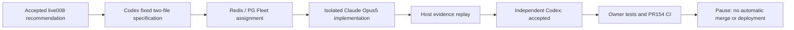

# Local absorption001: one real adoption completed

PR153 is merged and the local services use pinned runtime `a1b40e25a91d530d94a24178c39f37e8266e18e3`.
One actual isolated Claude Opus5 implementation and independent Codex review completed through Zeus.
The resulting BOM candidate is submitted in [PR154](https://github.com/trevi00/zeus/pull/154), **not merged or deployed**.
Fleet is paused and idle; monitoring and observation services remain available.

## What changed and what was demonstrated

The existing operator JSON reader now uses `utf-8-sig`. Optional leading UTF-8 BOM bytes no longer
cause JSON refusal. Parsed documents, packet/config identities, duplicate refusal, strict malformed
encoding handling and the 256 KiB raw-byte limit remain unchanged. Only the reader and its test file
changed in the Claude candidate. A real temporary BOM/CRLF/Korean file was refused by runtime153 and
accepted with equal decoded content by the candidate. This is compatibility evidence, not a measured
production incident fix or proof that all local assets have been absorbed.

| Evidence | Observed result |
|---|---|
| Operation | `local-absorption-001-utf8`, accepted |
| Claude requested / reported model | `claude-opus-5` / `claude-opus-5`, match |
| Candidate | `da6af9558d747c8911f72443fa4f411f26768aa2` |
| Candidate tree | `a51fda442d21ada5652f6db67c4ae4bafe8841e2` |
| Owner focused tests | 27 passed, 1 integration skip |
| Owner complete suite (Windows) | 2301 passed, 455 skipped |
| Owner lint | passed |
| CI | Required Windows/Linux and integration checks are reported at PR154; final outcome is recorded in its delivery comment |
| Calls | 227 -> 229; Claude implementation1 + Codex review1, both settled; no provider retry |
| Observation collection | 90 records, 90 inserted; corrupt0 / refused0 / sink failures0 |
| Worker profile observation | SessionStart1 + PostToolUse12; foreign/unreadable receipts0 |
| Final state | Fleet paused, active lanes0, worker/verifier containers0 |
| Existing C workspace | 130 recorded local files byte-identical and HEAD unchanged |

Subscription mode preserves usage counts and grant history rather than imposing the old finite192
ceiling. Grant `grant-00000011` changes the Fleet control mode; it does not reset the ledger. The batch
was still bounded to one job, two provider starts and a 900-second task limit. Provider-reported Claude
usage: input52, output16376, cache creation53333, cache reads970302. These are reported usage counters,
not a subscription invoice or a measure of unique context size.

## Failures, interventions and limits

- Claude initially used Korean config keywords, which violate the existing keyword contract. Its
  focused check failed; it moved the Korean text to a permitted rationale and reran successfully.
  This was within one model invocation, not another provider call.
- The permission layer refused a compound shell command for an old-decoder regression experiment
  and a `git -c` inspection command. Neither ran. The independent reviewer did not claim that the
  new tests had been executed against reverted code. The owner separately observed old/new behavior
  on the same actual BOM file. Hook receipts show execution, not universal instruction compliance.
- During deployment, old C-based monitor descendants held the collector lock after scheduled-task
  restart. A process inventory traversal was stopped before making changes when it did not finish;
  its cause is unestablished. Six explicitly identified old monitor processes were then retired and
  the collector restarted. This manual deployment intervention is not autonomous recovery evidence.
- Service evidence is hidden launcher configuration, pinned source import and fresh HTTP/PG monitor
  projections. No reboot/logged-out recovery or visual browser rendering was tested in this batch.
- Local skips are not passing integration tests; required CI supplies the separate integration and
  platform evidence. No unrelated environment or reference-analysis scope was reopened.

## Reproduction and ownership

The fixed frame is [SPEC.md](SPEC.md). [EVIDENCE.json](EVIDENCE.json) binds raw files by SHA256 under
`D:/workspaces/zeus/artifacts/local-absorption-001`. The source run, task, independent decision and
collector receipt are preserved there; raw files are not claimed to be uploaded to GitHub.

Clean candidate checkout: `D:/workspaces/zeus/artifacts/f2h/workspaces/28a16e28-25cb-558d-a199-dc6958110ed1`.
Owner validation used the existing Python environment, candidate `src` on PYTHONPATH, no bytecode or
pytest cache, and all logs/JUnit/temp files outside that checkout. Focused commands cover
`tests/test_dge_cli.py`, `tests/test_research_program.py`, `tests/test_research_program_cli.py`;
full `pytest` and `ruff check --no-cache .` are in the hashed owner runner and logs.

There is no automatic next job. PR154 merge/deployment and additional asset batches remain separate
decisions. PR153 runtime remains in service. No issue is closed by this delivery.
