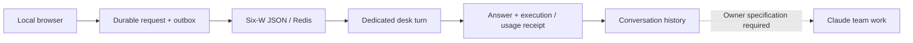

# Local operations desk — acceptance result

2026-09-20. Owner: Codex. Implementation: actual Zeus Claude jobs. Accepted runtime content:
`8511ceaa560b1a3bebeaa83a8a334bd054ab8b6a`. Frame and explicit exceptions: [SPEC.md](SPEC.md).

The local observatory now has a durable conversation desk: goal consultation, proposed work and
progress questions reach a dedicated `lead:frontdesk` through PostgreSQL/outbox/Redis and the
existing Codex executor. Conversation survives reload. A proposed change ends at `needs_spec`;
it neither assigns implementation nor approves, merges, deploys or promotes knowledge.

## Acceptance evidence

| Check | Observed result / limit |
|---|---|
| Actual browser consultation | `ed0fd3df-087b-4180-ac60-9dc28db3a87f`: answered; one settled Codex call |
| Actual browser work proposal | `3e508bed-7086-4747-8c0e-370f7bafd3e9`: needs_spec; one settled Codex call |
| Binding | Both succeeded tasks, own receipts and execution references, published results; correlated tasks are frontdesk only |
| Reload / viewport | Both answers visible after reload; desktop1440/mobile390 have no horizontal page overflow; browser errors empty |
| Duplicate / changed request | Same identity+body returns200, changed body409; no additional model call |
| Real isolated PG+Redis+HTTP | Concurrent create201/200, submit202/200; conflict409, foreign origin403, control400; new-connection history; real scoped Redis delivery/ACK; no provider call |
| Injected browser response loss | Actual session committed, response replaced with503; creation identity retained through reload, exactly one session restored |
| Injected client boundaries |503 uncertain; body deadline settles and aborts; synthetic transport, not network-outage measurement |
| Reporting | Five accounting-mode cases; owner delivery fixture retained; captured report immutable after source mutation |
| Tests | Baseline2466 passed/460 skipped; final focused220 passed; schema repair98 passed; npm lint/build and root ruff passed |

The baseline suite preceded final focused corrections; it is not claimed as a final full integration
run. Release requires the PR's final-head Windows/Linux, PostgreSQL/Redis and frontend CI checks.
Local skipped integration checks are not passing executions. Large logs remain on D, indexed with
hashes in [EVIDENCE.json](EVIDENCE.json).

Execution references: consultation `sha256:fca01a138f2786413cafe7f7310d940eb122b83153bf1a6593f224608f6a3906`;
proposal `sha256:cd12e80068d488dea4fe9d4372e621d85e0d0a79e9d770e007d13d201ea79c9e`.
The machine ledger reached255 after these calls; subscription mode records usage without the old
call-count ceiling. This is not evidence of unlimited provider allowance.

## Failures and acceptance judgment

The first real turn `7f67cb06-9134-4068-8ce2-8cb299288351` failed on provider
`invalid_json_schema`: optional properties were absent from `required`. Claude fixed the exact
schema, an independent Zeus Codex review accepted8511cea, and owner tests plus the two actual turns
confirmed it. The failed request remains failed, its slot counted; the termination was explicitly
reconciled as discard, without requeuing it. Official contract:
https://developers.openai.com/api/docs/guides/structured-outputs (opened2026-09-20).

Initial UI/backend jobs timed out and drafts were preserved. Later reviewer findings were repaired.
UI repaircc626221 stopped at its evidence gate; root Codex supplied direct source/browser/build
verification rather than relabelling that operation accepted. Backend repairebc0fe7's automated
rejection remains: malformed internal `budget=[]` or `jobs/lanes=[null]` can normalize misleadingly.
The trusted validated collector does not produce these shapes and this read-only explanation does
not control admission or spending. Owner accepts that explicit nonblocking limitation under the
user's critical-only launch preference; revisit on producer change or actual invalid input.

Owner verification had one nested-transaction probe error (10s advisory-lock timeout); moving its
Fleet read outside the transaction fixed the probe. It was not a product defect or model retry.
The early preview had a test-server resource-wrapper signature error; the wrapper was corrected.

## Operation and boundaries

Open the local observatory's **대화 창구**. This is its own stored session, not an automatic import
of the CLI conversation. Answers are unverified context. Requests require an owner-fixed
specification before Fleet assignment. History is bounded to100 requests per session and the last
10 answered turns/24k characters in model context. Unknown execution outcomes are not retried.

The owner release installs the pinned runner as hidden `ZeusDesk-run`, alongside the existing four
services, with a process lock and graceful stop. The local loopback adapter remains opt-in. Release
pin, service process inventory and readiness live in the owner deployment receipt; implementation
acceptance itself is not a deployment claim. Existing C checkout/auth/machine ledger stay in place.
The #157 delivery record is separately linked to three preserved evidence hashes, not inferred from
an accepted job. No new asset-absorption batch or automatic merge/deploy is authorized by this desk.
