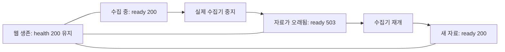

# Guardian 경험 흡수: 웹 응답과 관측 최신성 분리

2026-09-19. [PR #157](https://github.com/trevi00/zeus/pull/157)을 병합하고 로컬 운영에 배포했습니다.
이제 `/health`는 웹 서비스의 응답 여부를, `/ready`는 관측 자료의 최신성을 각각 표시합니다.
`/ready`가 200이라고 작업 성공이나 전체 시스템의 건강을 보증하지는 않습니다.

위 흐름을 배포 후 실제 수집기로 확인했습니다. 웹 서버를 재시작하지 않고 준비 상태가 회복됐습니다.
이는 소유자가 수행한 통제된 운영 실험이며, 자동 재시작 정책이나 장애 발생률 개선을 뜻하지 않습니다.

첫 실험은 예약 작업에 중단을 요청했지만 관측 자료가 계속 갱신되어 30초 안에 stale이 되지 않았습니다.
따라서 수집 중단이 성립하지 않은 실험으로 기록했습니다. 소유 프로세스의 PID·생성 시각·명령을 확인하고,
예약 작업을 일시 비활성화한 상태에서 해당 수집기 트리만 종료한 뒤 수집 프로세스 부재를 확인해 다시 측정했습니다.
실험 후 예약 작업을 재활성화하고 수집을 재개했습니다. 첫 실패의 정확한 잔류 경로는 이번 범위에서 확정하지 않았습니다.
`live-readiness-attempt1.json`과 당시 도우미를 보존했으며 런타임 코드는 이 때문에 수정하지 않았습니다.

## 흡수한 원칙과 범위

[Guardian 고정 검토](../../../full-analysis/guardian/review.md)의 원본 커밋
`e7ced4a632a38726dca44e84fa0a00b8e1f0b6f4`에서 프로세스 존재와 실제 관측 결과를 구분하는 원칙을 가져왔습니다.
원본 코드를 복사하거나 원본 테스트를 이번에 실행한 것은 아닙니다. 전체 로컬 자산 흡수 중 한 건입니다.

Zeus의 기존 20초 최신성 창과 5초 미래 시각 허용치를 사용합니다. 요청마다 스냅샷을 한 번,
최대 5,000,001바이트 읽고 수집 시각과 출처별 시각을 판정합니다. 실패·오래됨·읽기 불가를 준비 완료로 취급하지 않습니다.
응답은 고정 상태·사유·경과 시간만 담으며 원본 데이터, 오류, 경로, 자격증명을 반사하지 않습니다.
기존 프론트엔드·상태 API·수집기·PG 권한과 작업 판정은 바꾸지 않았습니다.

## 확인한 결과

| 확인 | 결과와 한계 |
|---|---|
| 실제 Zeus 실행 | Claude Opus5 구현 4회 + 독립 Codex 검토 4회. 구독 사용 원장 233→241, 모두 정산 |
| 최종 검토 | 수용. 실행 증거의 명령 주장 2/2 확인, 불일치 0. 독립 검토자가 호스트 전체 검사를 재실행한 것은 아님 |
| 최종 집중 검사 | Windows와 Linux 각각 69건 통과, lint 통과 |
| 소유자 Windows 전체 검사 | 2,369 통과 / 460 건너뜀. 런타임이 동일한 `5666841`에서 실행; 건너뛴 검사를 통합 성공으로 세지 않음 |
| 최종 후보 | 이후 변경은 테스트·기록뿐. `5666841` 대비 src 차이 없음; 최종 CI는 새 후보 전체를 검사 |
| 독립 HTTP 확인 | 실제 임시 파일·서버에서 합성 스냅샷 14경계 통과, 서브밀리초 시각 경계 확인 |
| Windows 동시성 실측 | 미리 정한 1회: 1,000 HTTP 읽기 / 200 교체. fresh200 612, stale503 366, unavailable503 22, 요청 오류 0 |
| 최종 CI | [35448385389](https://github.com/trevi00/zeus/actions/runs/35448385389), attempt 1 성공. Windows/Linux 3.12·3.14 및 실제 PG/Redis 통합 |
| 운영 실측 | 수집 중단→stale503→수집 재개→ready200. 그동안 health200, 웹 재시작 없음 |
| 관측 수집 | 네 작업 합계 381개. corrupt/refused/sink failure 모두 0 |
| 기존 작업 보존 | C 저장소의 HEAD와 미커밋 자료 130개 해시 유지 |
| 종료 상태 | Fleet paused/idle, worker/verifier 컨테이너 0. 관제·로그 수집은 실행 중 |

호출 수는 구독 사용 기록이며 달러 청구액이나 고유 컨텍스트 양이 아닙니다.
동시성 실측은 해당 로컬 조건에서의 읽기 불가를 확인한 것입니다. 과거 CI의 숨겨진 실패 원인을 확정하지 않습니다.

## 실패와 보완 이력

| 후보 | 관측과 처리 |
|---|---|
| `d37368b` | Windows 테스트 ID가 너무 길어 setup/teardown 실패. 입력을 줄이지 않고 ID만 단축. 첫 CI는 소유자가 취소. 반올림으로 19.9996초가 stale이 되는 경계도 실제 나이 비교로 수정 |
| `5666841` | Windows 전체 검사 통과. CI Linux 3.14는 깊은 JSON을 다른 단계에서 안전하게 503으로 거절했지만 테스트가 특정 거절 사유만 허용해 실패 |
| `5153bcb` | 깊은 JSON의 두 안전한 거절 사유를 허용. CI Windows 3.12에서 모든 읽기가 가능하다는 동시성 테스트 가정이 실패. 당시 상태·사유를 보존하지 않아 정확한 원인은 미확정 |
| `4bb1ce7` | 동일한 40읽기·20교체 유지. 읽힌 문서는 완전하고 일관돼야 하며, 못 읽은 경우만 명시적 unavailable503 허용. 오류/손상은 실패, 이후 200 회복 필수. 응답 전체를 진단에 보존 |

기존 CI `35445678030`, `35446193663`, `35446996683`의 취소·실패를 최종 성공으로 덮지 않았습니다.
두 번째 CI의 Windows 작업은 새 커밋 갱신으로 취소됐습니다. 최종 커밋의 성공은 이전 실패가 없었다는 뜻이 아닙니다.
Claude는 마지막 동시성 분포 관측을 위해 한 번 의도적으로 단언을 실패시켰고 이를 복원한 뒤 통과했습니다.
이는 결함 재현 증거가 아닌 진단 시도이며 구현 기록에 남겼습니다.

## 버전과 원본 증거

- 후보: `4bb1ce72a8fde673e328d27e6a6face0eb82696f`, 트리 `1852a6a33257dcfd62e2a9f3128a0ead1e14d0a5`.
- 배포 병합: `d8d7df56855b76ac89ad6b25f53311d2b5cce511`, 후보와 트리 동일. 운영 경로 `D:/workspaces/zeus/worktrees/runtime-157`.
- 원본 루트: `D:/workspaces/zeus/artifacts/monitor-readiness-001`.
- `EVIDENCE.json`: SHA-256 `b618fc953d4f098c6a7090116d66f68274716348ab0db52f1ed9b8758f9313bd`, 97개 파일 경로·크기·해시.
- 작업: `monitor-readiness-001`, `monitor-readiness-001-correction`, `monitor-readiness-001-portability`, `monitor-readiness-001-concurrency`.
- 주요 증거: 각 작업의 `operation-receipt.json`, `provider-facts.json`, `owner-validation.json`,
  `correction-001/owner-full.xml`, `owner-http-probe.json`, `concurrency-probe.json`, `final-ci.json`,
  `deployment.json`, `live-readiness.json`, `final-state.json`.

원본은 D에 보존합니다. Git의 해시 기록은 원본의 원격 다운로드 가능성을 보장하지 않습니다.
절전·재부팅·웹 화면 시각 검증은 이번 범위가 아닙니다. 로컬 일반 파일을 전제로 하며 멎은 저장소의 응답 기한은 보장하지 않습니다.
파서 docstring의 재귀 설명이 환경 차이를 충분히 표현하지 못한 점은 구현 기록에서 정정했고,
그 사소한 문구를 이유로 수용한 런타임을 다시 수정하지 않았습니다.

다음 작업은 자동 배정하지 않았습니다. 다음 자산은 별도 완료 조건으로 이어갑니다.
