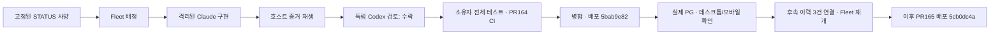

# Operating portfolio-001: 프로젝트 활동 전달과 보고 정정

[PR164](https://github.com/trevi00/zeus/pull/164)가 병합되어 `5bab9e82f9fadfaa94728c51a46d0e95a094c16d`로
배포되었습니다. 실제 Claude 구현 1건과 독립 Codex 검토 1건은 **이 배포보다 먼저** 수행되었습니다(이전
초안의 "배포 이후 수행" 서술은 사실과 달라 정정합니다). 이후 PR165가 `5cb0dc4ada51bb66412eb1f5b642fb793b286ce6`로
배포되었습니다. 아래의 수치·커밋·후속 연결 3건은 모두 **PR164 배포 시점 스냅샷**이자 **소유자가 제공한
증거 요약**이며, 현재 런타임 값이 아니고 이 문서를 작성하며 재실행하거나 관측한 것이 아닙니다.

## 무엇이 바뀌었나

기존 `portfolio`가 확장되었습니다. 소유자 전용 불변 링크 `follow_up(원본, 후속, 증거)`와 실패 1건당 한 줄을
갖는 버킷이 추가되어, 과거 실패와 수락된 후속 작업의 관계가 **명시적으로** 기록됩니다(이름·날짜 추론
없음). 프로젝트마다 표본 추출 이전의 전체 모집단 활동 수치(진행 중, 배정 대기, 확인 필요, 조치 필요,
연결된 이력, 수락)가 계산됩니다. 실패 기록은 연결 후에도 접을 수 있는 이력 영역에 남습니다.
Fleet 스케줄링과 모델 프롬프트는 건드리지 않았습니다.

## 세 가지 "수락"을 구분합니다

| 구분 | 의미 | 이 전달에서의 상태 |
|---|---|---|
| 작업 수락 | 독립 검토자가 후보 구현 1건을 수락한 것 | 완료 (작업 단위, 배포 이전) |
| 소유자 기준 수용 | 프로젝트 기준에 대한 소유자의 수용 기록 | **별개이며 이 전달로 전체 기준이 수용된 것은 아님** |
| 배포된 커밋 | 런타임이 실제로 가리키는 커밋 | PR164 시점 `5bab9e82f9fadfaa94728c51a46d0e95a094c16d`, 이후 PR165 `5cb0dc4ada51bb66412eb1f5b642fb793b286ce6` |

화면의 활동 라벨(진행 중, 배정 대기, 확인 필요, 조치 필요, 현재 실행 없음, 미착수)은 활동 상태일 뿐 기준
완료가 아닙니다. 연결(`follow_up`)은 소유자가 기록한 관계이며 사건 해결·기준 수용·병합·배포를 뜻하지
않습니다. 진행 중인 프로젝트도 미해결 과거 실패를 동시에 가질 수 있어 둘 다 표시합니다.

## PR164 배포 시점 스냅샷: 소유자 증거에 기록된 사실

| 항목 | 기록된 결과 (PR164 시점) |
|---|---|
| 배포 커밋 | `5bab9e82f9fadfaa94728c51a46d0e95a094c16d` (PR164 병합) |
| 소유자 로컬 전체 스위트 | 2574 passed / 475 skipped |
| CI | Windows · Linux · 통합 검사 통과 |
| 실제 PG 확인 | 데스크톱/모바일 확인, 브라우저 오류 없음 |
| 연결된 후속 이력 | 3건, 원본 실패 기록 보존 |
| Fleet | 재개됨 |

| 원본 (실패) | 후속 (수락) — PR164 시점 3건, 이후 추가된 연결은 미포함 |
|---|---|
| `operating-portfolio-001-interface` | `operating-portfolio-001-frontend-canary` |
| `operating-portfolio-001-harness` | `operating-portfolio-001-completion` |
| `observation-boundaries-001` | `observation-boundaries-001-completion` |

| 증거 파일 | SHA256 |
|---|---|
| `deployment.json` | `sha256:d4a250582d9a9bdfd17484ef74ecf311e0957f393f8d980031fe78af90ccacaa` |
| `live-check.json` | `sha256:f7b55330862be9af639ed10764e55c0b5a8bef09eb50d7029693036b34d341ba` |
| `final-state.json` | `sha256:f2d9b9af2598d2d9de201fbf9b82544a5f436d853af2bfad5802bb963ba7ecb3` |

PR164 배포 시점에 제공된 라이브 관측: `ready: true`, `head: 5bab9e82f9fadfaa94728c51a46d0e95a094c16d`,
`portfolio_age_seconds: 4.82463`, `asset: index-BhWboFqN.js`(읽기 전용 라이브 API와 실제 PG·브라우저 확인).
이 `head`는 **그 시점의 값**이며 현재 런타임 head가 아닙니다. PR165 배포 이후 값은 다시 확인해야 합니다.

## 이 보고서 자체의 이력

첫 보고 작업 `portfolio-report-001`은 148739 ms 후 provider 종료 오류 `error_max_structured_output_retries`로
**실패**했고, 독립 검토에 도달하지 못한 채 지금도 실패로 남습니다. 다만 성공한 Write 수신 기록이 89줄
초안을 보존했습니다(원본 아티팩트 SHA256 `b0860916ed39ec0cfc4ebc1c0cf7e8e9636853ac962f040a62a6920db9211a07`,
초안 SHA256 `0014184a96a161e7ef178317184572dab5bb2fa9ee09a3007ad6d06177b5e8e1`). 그 초안의 잘못된 시점
서술을 이 개정에서 고쳤습니다. 이 문서도 아직 독립 검토 전이며, 실패한 원본 작업은 수락된 후속 작업이
존재한 뒤에만 연결됩니다.

## 남은 일

이 전달로 완료되지 않은 항목: 로컬 자산 전체 흡수, 거부된 작업 자동 재배정, 에이전트 실행 카드
(STATUS 확장안, 미착수). 자기개선 재설계·새 팀 구성은 Ouroboros · Hermes · Oh My Hermes의 정확한
저장소를 분석할 때까지 보류입니다.

## 한계

- 라이브 조사 자동 디스패치·자동 병합·자동 배포를 수행했다는 주장은 하지 않습니다(병합과 배포는 소유자 결정).
- 위 테스트·CI·PG·브라우저 확인은 모두 소유자가 제공한 PR164 시점 결과이며 이 문서 작성 중 재실행하지 않았습니다.
- 알 수 없거나 대기·실행 중인 후속 작업은 과거 실패를 해결하지 않고, 잘린 표본에서 전체 수치를 추론하지 않습니다.
- 고정된 사양은 [SPEC.md](SPEC.md), 현재 상태와 확장 요청은 [STATUS.md](STATUS.md)에 있습니다.
- 이 전달로 닫히는 이슈는 없으며, 자동으로 이어지는 다음 작업도 없습니다.
