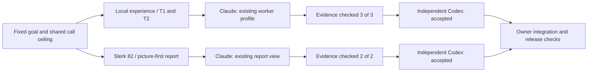

# Parallel adoption 001 — owner result

Two real isolated Zeus Claude operations completed concurrently, each followed by its own independent
Codex review. Both corrected-run operations are `accepted`; integration is owner-controlled.

This diagram describes the two named executions below. It is not a claim that all reference assets
were absorbed or that a persistent multi-job dispatcher was installed.

| Lane | Operation | Candidate | Result |
|---|---|---|---|
| Experience | parallel-adoption-001-experience-short | 8123c33d0f0f4ad3336817b70da6ee945ca1451e | accepted |
| Visual report | parallel-adoption-001-visual-short | ded800d21263cb1668d7da12422cf616828f1eff | accepted |

Both worker containers were observed running at 07:02:35 UTC on 2026-09-18. Operations started
at 07:00:39 UTC; wrappers finished at 07:11:32 (visual) and 07:12:10 (experience). Each lane owns a
PG schema, Redis namespace and runtime root; task sets are disjoint. The shared machine ledger
advanced 148 ->152 for the corrected run (two implementations and two reviews). No automatic retry.
Final lane collection inserted two final events each, sink failures/conflicts/corrupt/refused all0.
No worker-side queued/running/retry row remains. Conductor release authority is retained.

## What changed

- Experience: T1/T2 from the existing pinned source analysis became concise guidance inside the
  existing worker profile. Revision/run binding, independent recurrence, supersession and historical
  incident scope are explicit. Profile remains 5988/6000 normalized characters with matching digest.
  Existing authority/permissions are retained. This is guidance adoption, not a measured behavior
  improvement or automatic promotion of source claims into knowledge.
- Reports: existing Report v3 and shadcn/Lucide components now render source-state diagrams and
  category/severity/operation distributions first. Six native disclosures retain detailed records.
  Capture/freshness/unknown/truncation limits remain visible. Print opens details and restores them.
  No new backend, report schema, counts, dependencies or write authority.
- Programme: the same SPEC links the existing full-analysis authority to Sterk dependency groups;
  no duplicate coverage ledger. The 27 reference issues are captured with body hashes, not marked
  semantically reviewed or closed by this delivery.

## Verification and limits

Worker evidence: experience 50 focused tests, visual28; inspector 3/3 and2/2 claims checked.
Owner: existing call-boundary tests23 passed, TypeScript/Vite build and ESLint passed, Ruff passed.
Browser: actual public snapshot, pinned JSON unchanged after refresh, 390px body width390,
six collapsed details, dark token rendering, zero page errors. Unknown/empty/truncated cases are
explicit browser-only synthetic inputs. Seven PDF pages rendered with all detailed evidence labels.
Full local Windows suite: 2086 passed, 454 skipped in543.70s. Skips remain skips, not real-service
coverage. Final-head CI/release is recorded in the linked issue #144 closeout evidence.

Preserved failures: the first two attempts failed exporting deep paths before the adapter's container
creation step. Both slots remain counted (146 ->148), and the original failed operations and
unsettled_unknown reservation records remain unchanged. Exact source export succeeded under a
shorter D prefix (5062 files); runtime roots alone were shortened for the distinct corrected IDs.
The source-preparation failure is not a provider outage. Two browser capture attempts were invalidated
by automation switching to about:blank during download. The corrected test captures the product Blob
while suppressing only download-anchor navigation; no product code was changed to satisfy that test.

Raw evidence: D:/workspaces/zeus/artifacts/parallel-adoption-001; lane runtimes p1e/p1v under the same
artifacts root. Hashes are in evidence-summary.json. Original dirty local analysis files stay untouched.
The public monitor displays its public scope; isolated pilot-lane records are not silently copied
into it. Permanent lane scheduling/aggregate monitoring, whole-source absorption and measured
experience efficacy remain explicit subsequent work, not new gates on this completed bounded batch.
