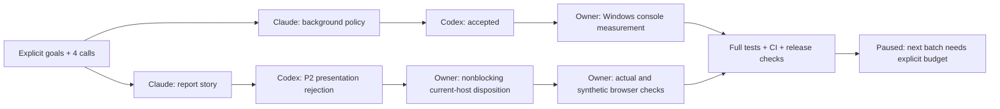

# Background execution and picture-led report

User goal: hide Zeus console flashes while retaining errors/logs, and explain actual team goals,
outcomes and remaining work visually. Operate automatically within an explicit finite budget.

## Observed change

Before: a no-console Python parent calling existing run_process produced a child with a console
handle and a visible console window. After candidate1c8829d: both the direct child and cmd->child
path returned exit0 with no console handle and no visible console. Native Windows focused tests:
20passed,0skipped. This establishes those paths, not attribution of every historical desktop flash.
The shared helper preserves process-group/suspended flags, Job ownership, timeout and output rules.
Linux worker evidence: assigned65passed/6skipped; related202passed/2skipped; inspector5/5 checked.

Report now starts with a goal/team/verdict/remaining diagram and finite-operation control strip.
Actual fleet rows supply the nodes; conceptual arrows do not claim measured intermediate steps.
Candidate acceptance is distinct from merge/deployment, and sampled call sums are not machine spend
or remaining balance. Aggregate graphs and six evidence disclosures remain below the story. JSON
v4 contains the same captured story; no live data or model-generated diagnosis enters it afterwards.
The before/after panel describes this UI change, not measured operational improvement.

Owner frontend: TypeScript/Vite build and ESLint pass. Browser: actual registered fleet/finite controls;
poll does not mutate captured JSON; synthetic missing/unavailable/unregistered/invalid, stale,
truncation, unknown dependency and null calls.390px has scrollWidth390; light/dark inspected. The
print event opens six disclosures and restores them afterwards; no exported-PDF rendering claim.
Browser errors0. Actual and synthetic data are labeled separately in browser-proof.json.

## Review disposition and bounded usage

Backend candidate1c8829d30b27f41b86010bfd612cca4121304fb9: independent review accepted.
UI candidatea12afdd7334e60aa53640079cdec4c3a50777169: independent review rejected for one P2:
unregistered stale captures lack an inline stale badge. Source time and fixed capture qualification
remain visible; registered stale captures have a warning. Owner confirms the residual and accepts
it as nonblocking for this registered immutable local fleet under the user's critical-only policy.
No machine verdict was overwritten: the report correctly continues to show that rejected operation.
This is an explicit owner release judgment, not a claim both machine reviews accepted.

Machine budget160->164: two Claude implementations and two Codex reviews,4reserved/4settled,
no retry/automatic budget increase. Fleet paused after admission so only those jobs could run.
Ceilings are call counts; provider monetary flags do not establish a measured spending guarantee.

## Release evidence and operation

Raw evidence: D:\workspaces\zeus\artifacts\report-background-001. The checked-in manifest pins native,
browser and execution observations available at packaging. Owner full-suite (-ra skip reasons), CI,
final merge SHA and installed-task evidence are attached to issue#148 before closure. These lines
do not represent pending checks as passed. The issue remains open until release conditions pass.

Deployment uses a GUI-subsystem pythonw task entry and CREATE_NO_WINDOW for the existing PowerShell
launchers, plus the reviewed child-process policy. Existing task principals/triggers remain; entry
events keep bounded type/exit logs. Original task XML is retained for rollback. Stop/restart only
after the fleet is paused/drained; terminate only exact captured Zeus process descendants with
matching creation times. Never close arbitrary user terminals. No logged-out/reboot claim.

Known owner orchestration attempts: an initial relative git-add ran from frontend/monitor and did
not stage SPEC (then committed from root); a read helper ran outside the main dotenv cwd and failed
without mutation (rerun from main); a preview Start-Process invocation was blocked by tool policy,
so preview ran as an explicitly managed exec session instead. None was a product-code defect.

Next finite batch is a separate goal/manifest and explicit idle budget grant. Existing paused164
ceiling does not renew itself. Cosmetic stale-unregistered warning improvement stays a documented
follow-up rather than another call/review loop in this delivery.
