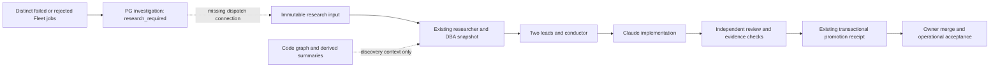

# Research dispatch and contextual knowledge absorption

Status: Codex source assessment and architecture decision, 2026-09-20. Implementation not submitted.
Baseline: Zeus `306bc813d5d9de6b8036510ce8d0cecfac9f01c7`.
Continues operating-portfolio-001 and two-strike-001; their accepted behavior is preserved.

## Outcome and scope

Turn repeated failures into bounded, evidence-backed improvement through the existing research,
debate, implementation and independent-review path. Absorb local experience without duplicating
schedulers, knowledge authorities or prompt rules. The user authorized local Claude asset absorption,
use of the Naver article and Graft as references, and the existing Codex-design / Claude-implementation
role split. This document is the one frame for the next dispatch batch and its context boundaries.

This source-assessment delivery is complete when sources are pinned, the existing path is traced,
overlap and limits are recorded, and implementation priorities have fixed acceptance conditions.
That is not completion of runtime dispatch or repository-wide absorption.

The next implementation batch is the investigation-to-research bridge. Graft extraction, a new graph
database, global hooks, a new inference engine, provider changes, automatic merge/deployment and
whole-repository absorption are outside that batch. Context enhancements below are ordered follow-up
work, not additional blockers on this batch. Existing operational jobs retain their immutable inputs.

## Questions that change the approach

1. Does Zeus already own the graph, research lifecycle and promotion authority? Yes: reuse them.
2. Does a two-strike candidate already start and consume research? No connection was found in the
   inspected `portfolio.reconcile`, Fleet reconciler wiring and `ProgramRunner.tick` path.
3. Is Graft's generated graph equivalent to accepted knowledge? No: structure and model summaries
   are distinct in its schema; neither provides Zeus execution/review authority.
4. Can its retrieval hook run unchanged in a Zeus independent review? No: the refresh path writes
   cache files, while the review checkout contract prohibits writes. Host preparation or an external
   cache would be required; adoption needs a separate executed compatibility check.

## Sources and evidence

Observed 2026-09-20; upstream tests were **not run**. Source inspection is not execution evidence.

| Source | Evidence inspected | Supported conclusion / limit |
|---|---|---|
| Local `.claude`, `7f2d97dab465aa1670267137354d0d44c51fb688` | `scripts/lib/strike_dispatcher.py`, partial `scripts/cli/strike_research_consume.py`, partial `skills/_common/self-improve.md`; previous two-strike frame pins blobs | Dispatch and result consumption are separate responsibilities. File quota checks and increments must not replace Zeus transactional ownership. No full semantic coverage claim. |
| [Naver article](https://m.blog.naver.com/pjbmask/224285723127) | Public HTML fetched successfully via PowerShell after web reader failed; text inspected | Useful distinction between vocabulary, graph, retrieval and metric definitions. Secondary explanation, not an implementation or universal definition. |
| [Graft](https://github.com/trailhq/Graft/tree/8c05769618d413041ea2c8891f82d566f0461b3c), package 0.18.0 | Commit `8c05769618d413041ea2c8891f82d566f0461b3c`, tree `fc807f1c63e183bacdcfe6697e25cc259b79230a`; all 338 tracked paths inventoried with mode/object/size | Bare acquisition only; no install, hooks or upstream execution. All paths retain unreviewed semantic disposition. |
| Graft code at that commit | Full reads: `src/graph/types.ts`, `check.ts`, `invariants.ts`, `load.ts`; partial `refresh.ts`, `src/mcp/tools.ts`, `test/graph-refresh.test.ts` | Schema separates extraction from summary state and marks edge confidence. Refresh is called from MCP; cache loads have invalidation handling. Partial call-path assessment, not end-to-end verification. |
| Graft `LICENSE`, `package.json` | MIT license; Node >=20, tree-sitter dependencies and install/prepare scripts | Any copied substantial code requires attribution. Dependency/platform compatibility not verified. No dependency is added by this assessment. |
| [W3C OWL 2 overview](https://www.w3.org/TR/2012/REC-owl2-overview-20121211/) | 2012-12-11 Recommendation, introduction/semantics | Formal vocabulary and semantics are separate from graph storage. This does not require Zeus to install an OWL reasoner. |
| [Microsoft GraphRAG](https://microsoft.github.io/graphrag/) | Official introduction, accessed 2026-09-20 | Graph-based retrieval is a method of providing context; it is not a Zeus acceptance authority. |

The article's claims about Graph RAG lacking rules and ontology requiring a running inference engine
are not adopted as universal constraints. A system may combine an explicit schema with retrieval;
an ontology's existence and execution of a reasoner are distinct facts.

Large source evidence: `D:/workspaces/zeus/artifacts/graft-reference-001/`.
`inventory.json` SHA256 `a9e26e3511d68a8b462430f09fc46e35f2f090714682b17b8b764bab2875dfc0`.
`naver.html` SHA256 `7572a426d08fc31bd4a5a153e07d8abd19aa48b248935503951aaf8d1354eed0`.
`evidence.json` lists remaining hashes. Raw article text is local evidence, not copied into Git.

## Existing complete path and authority

- `application/portfolio.py:reconcile` groups distinct failed/rejected jobs by safe status/reason,
  persists investigation candidates and preserves owner dispositions. Shared symptoms are not causes.
- `adapters/fleet_cli.py` wires the existing periodic reconciler; it is not a second model scheduler.
- `application/research_program.py` reserves a cycle before I/O and owns selection/capture/run/result.
  `adapters/research_program.py:ProgramRunner.tick` currently gathers local Git candidates and feeds.
- `domain/research_program.py:derive_manifest` preserves authorized template scope, adds the immutable
  discovery snapshot, and explicitly calls it untrusted. Extend this path rather than create a parallel
  research executor. `application/council.py` already freezes research and an SSOT snapshot before debate.
- `adapters/knowledge.py` already extracts Python syntax, records revisions and snapshot hashes,
  stores graph nodes/edges, and supports lexical/vector retrieval. `may_call` is intentionally not
  proof of runtime invocation. The inspected query returns node metadata but no uniform freshness
  verdict bound to the requesting revision.
- `application/promotion.py:promote` writes a graph and receipt transactionally after caller validation.
  Its own authority explicitly does not mean prose is universally true or code has been merged.
- Independent autonomous execution uses `knowledge=False`; enabling a writable graph adapter during
  review would violate the existing boundary. A stored PG cache is not automatically accepted knowledge.

## One architecture, four responsibilities

| Responsibility | Zeus owner and adaptation | Authority |
|---|---|---|
| Vocabulary and constraints | Git contracts: project, goal, task, attempt, evidence, investigation, decision, revision; typed relation endpoints | Definitions; no invented logical inference engine |
| Code and operational topology | Existing graph adapter and PG runtime projections | Observed/extracted structure, source-bound and revision-bound |
| Context selection | Read-only bounded context packet over existing ports, prepared outside review checkout | Derived discovery context, with freshness and provenance |
| Metrics and acceptance meaning | Shared domain projections used by API, report and dashboard | Exact denominators and state definitions; no UI-specific success formula |

Use composition and existing ports. Domain owns validity and selection policy; application owns
transactional claims and state transitions; adapters own Git/PG/files/provider I/O. Add a Strategy or
adapter only for an actual alternate source. Do not build a generic plugin framework for one bridge.
Prompt templates carry goals, evidence and role instructions; they do not enforce ownership or trust.

## Ordered absorption decisions

1. **Implement next: local dispatch/consume experience.** An explicitly authorized research program
   may consume eligible portfolio investigations. A transaction must reserve the investigation and
   cycle together, keyed by investigation identity, before any model work. Replayed events, new program
   IDs, concurrent runners and restarts must not silently create another attempt. Preserve a separate
   dispatch/result link; do not overwrite the owner's researched/deferred disposition or call an
   accepted council result a solved incident. Failed/unknown work retains its claim and recovery facts.
   Reuse the existing research-before-debate path, snapshot capture and authoritative run-row result.
   No execution solely because a graph node or model says a change is safe.
2. **Adapt after bridge: context provenance and freshness.** Source revision/hash, source scope,
   extractor version, extraction vs inference, summary pending/ready/stale, completeness and retrieval
   bounds belong in a context envelope. A fresh structure does not verify its summary. Scope caches
   by repository/revision/profile so parallel worktrees do not contaminate each other. Unknown/stale
   input is visible and falls back to bounded original-source inspection, not promotion.
3. **Adapt after measured need: contextual retrieval and impact view.** Reuse existing query/graph;
   evaluate Graft's symbol lookup and relation traversal against actual Zeus tasks. Preserve unresolved
   edges, distinguish potentially affected components from actually tested components. Graph images
   must expose provenance and missing coverage, not imply proof by being visually connected.
4. **Unify metrics as part of affected projections.** Count discovered, dispatched, researched,
   independently accepted, merged and operationally verified separately. Report success with distinct
   attempts and unknown/skipped counts; report recurring failures after a fix in a declared observation
   window. Token savings are measured against a stated comparable task baseline, not upstream marketing.

Do not adopt Graft's automatic hook wiring, default query writes, silent unreadable-as-removed semantics,
or stale fallback as verified context. Do not reproduce its graph beside the existing graph without a
demonstrated missing capability. Its README benchmark numbers are not Zeus performance evidence.

## Fixed acceptance matrix for the dispatch implementation

| Boundary | Acceptance check |
|---|---|
| Normal | Two distinct qualifying jobs -> one candidate -> one authorized claim -> immutable snapshot -> existing council; result linked to exact run and manifest digest. |
| Scope | Disabled/unregistered/out-of-scope programs dispatch nothing; no widening template paths, role authority or provider controls. |
| Replay / concurrency | Two workers or two programs cannot claim the same investigation; replay retains the original reference. Transaction rollback leaves no external execution. |
| Restart | Crash after claim/start remains owned/unknown with recovery information; no timeout-based implicit model replay. |
| Failure / unavailable | Store, source, capture, model and result-read errors remain explicit; missing evidence cannot become researched/resolved. Preserve fixed safe reason and correlation IDs. |
| Deadline / cancellation | Existing deadline and cancellation apply; no new retry or silent deadline extension. |
| Result authority | Missing/mismatched/running run is unknown. Model prose cannot supply completion; owner disposition and promotion requirements remain intact. |
| Context | Research receives source/status/revision plus bounded job references; errors/credentials/raw provider streams never enter the packet. Identical symptoms stay a hypothesis. |
| Observability | General: claim/start/end; development: capture/run bindings and bounded counts; operations: blocked/unknown/recovery. Monitor/report distinguish dispatch from acceptance. |
| Platform / cleanup | Memory and isolated PG exercise the same transitions; Windows/Linux CI cover path/digest logic. Evidence outside clean checkout. Existing GitCapture cleanup reused. No new container lifecycle needed. |

Required checks are focused bridge/portfolio/research
program tests, meaningful PG concurrency coverage, ruff and the repository suite/CI owned by Codex.
One explicitly labelled actual dispatch canary is needed before claiming live autonomous consumption.
Injected council tests prove transition contracts, not live research quality.

## Consolidated implementation handoff

Add optional `investigation_source` to the existing version-1 research-program configuration:
`{"topic": "<existing topic id>", "project_ids": ["<portfolio project id>"],
"reason_codes": ["<fixed safe reason code>"]}`. Lists are nonempty, unique and bounded (20 projects,
50 codes). Missing means disabled and preserves the old canonical configuration/digest exactly;
null, empty, wildcard or unknown fields are rejected. This opt-in authorizes only the program's
unchanged template plan, not arbitrary repairs. It is evaluated on an existing program tick;
this batch adds no daemon or implicit recurring schedule.

Within `ResearchProgram.record_collection`'s existing transaction, read investigation rows,
portfolio bindings and Fleet jobs. Eligible investigation: research_required, allowed reason,
and at least two distinct referenced terminal jobs with matching family status/reason AND immutable
bindings to allowed projects. Use only those scoped job IDs; never include unrelated family members.
Exclude malformed/unknown rows, record bounded exclusion counts, and never derive root cause.
Adapters cannot supply an investigation candidate as an ordinary discovery item: reject that source
at the collection boundary; synthesize it only from the authoritative transaction reads.

Select at most one candidate using the existing cycle/adoption/usage controls. Eligible investigations
sort before local and external candidates, with deterministic ID ordering. Immediately before selection,
revalidate stored eligible investigation candidates against current scope/state/claim; candidates whose
owner disposition changed cannot later run from an old cache. Reserve a separate
`research_investigation_dispatches` row keyed solely by investigation ID, in the SAME transaction as
candidate selection and cycle reservation bookkeeping. It binds program, cycle, immutable bounded
snapshot digest, scoped job IDs, reason/family status, and timestamps. Across programs it is one claim,
not one claim per program. Unknown outcomes do not release ownership automatically. Existing serialized
store transactions supply atomicity; do not add file locks or a second scheduler. Never change
`portfolio_investigations.state` from this bridge.

The selected candidate carries that immutable snapshot (versioned schema, investigation/program/cycle
identity, scoped job IDs and digest, fixed codes, observed time, explicit unverified trust). Enforce a
bounded sample of at most 50 job IDs and retain total count and digest of the full scoped ID set so
truncation is explicit. Use the existing GitCapture and artifact path before council startup. Extend
`snapshot_document` to preserve the snapshot rather than silently dropping it; normal local/external
snapshots retain their existing shape. No raw task prompt, output, exception or credential is copied.

Bind the dispatch row to the exact recorded council run/manifest when it starts. On result, read the
authoritative autonomous run and validate through the existing `council_result` helper inside the
transaction before recording the dispatch result; caller-provided prose or an `accepted` string is
not authority. Accepted/rejected/failed/unknown are dispatch outcomes, never an owner disposition or
incident-resolution claim. Capture/pre-start failures retain a failed dispatch with fixed stage/code;
store failures retain the durable claim and expose unknown/recovery via existing behavior. Persist
result bindings and cycle result together. Do not retry or force cleanup.

Expose the safe investigation ID and dispatch result in existing program candidate/cycle status and
report projections, preserving legacy entries. Existing EventLog categories should include claim,
capture and outcome identifiers; log no raw payload. Do not alter the frontend, provider, image,
global Claude configuration, writable graph wiring or promotion contracts in this batch.

Implementation files: existing domain/application/adapter research_program modules; a small pure
domain helper is allowed if it keeps validation separate from storage. Add focused tests in
`tests/test_research_investigations.py`, using MemoryStore and the existing isolated pgstore fixture.
Exercise actual ProgramRunner with explicitly injected council responses for the seam tests; call
these synthetic. Include opt-out compatibility, scope exclusion, two programs racing, replay,
changed disposition, failed capture, missing/mismatched run, and no owner-state mutation. Owner
handles full suite/CI and live canary; Claude runs focused tests and ruff and reports exact commands.

## Residual limits and stopping rule

This assessment is a source-backed design decision, not a Graft adoption approval. Neither Graft nor
all local assets have full semantic coverage. No upstream code has executed, no source has written
global hooks, and no new verified knowledge has been promoted. Upstream Windows/WSL behavior,
language coverage, retrieval quality and token savings remain unmeasured.

Complete the dispatch batch when its fixed matrix passes and its named live evidence is recorded.
Do not hold it for all-language graphs, visual redesign, OWL inference or complete local absorption.
Those become follow-up work only when the next task needs them. Reuse this frame if a real obstacle
changes the design; do not turn each source feature into a new blocking ticket.

## Recovery: evidence replay outlived its lease (2026-09-20)

Actual run `research-dispatch-001` produced candidate `3277873` (preserved in a Git bundle under
the task artifact directory, imported as `4488ea4` on this branch). Container exit was 0; changes
were imported. This is not acceptance. Host inspection `b346fcd924cfc6322375cb76f23eed4421eee3f894db68282cf200bb99998d32`
finished at 05:21:35 UTC after task lease 05:20:28 UTC. Final operation failed `execution_stale`.
Inspection had 6 checked claims, one exit mismatch (output-schema baseline test), and one full-suite
replay timeout at 300 seconds. The worker had run a full suite contrary to this frame. Failed
evidence is preserved; do not rewrite it or mark the old task successful.

The affected assumption is that provider heartbeat covers the entire owned execution. It does not:
executor renews immediately after the provider, then synchronously inspects evidence with no renewal
while subprocess replays run. Corrective batch: maintain and check lease ownership THROUGH evidence
inspection, rather than enlarge its 600-second lease or remove checks. Reuse the existing workflow
heartbeat and remaining-time checks. A per-call optional progress/cancellation callback may flow through
EvidenceInspections -> EvidenceInspector -> host/Docker capture; use bounded process polling to invoke
it during waits, and before/after commands. No mutable global callback or detached renewal thread.
On lost ownership/deadline, stop new replays, reclaim the owned process/container through existing
cleanup, and never publish success from the stale owner. Preserve adapter defaults for callers that
do not provide a callback and keep inspection identity/digests and output policy unchanged.

Additional acceptance: delayed command with continued renewals; ownership loss during command;
callback exception; timeout and cleanup; no callback compatibility; Docker forwarding; no remaining
renewal worker after return. Use deterministic short/fake clocks and actual short child-process tests
where appropriate. Do not wait ten minutes in tests. Existing positive inspection and redaction tests
must still pass. Tests/injected ownership loss are not live recovery evidence.

Claude implements this correction on the preserved candidate. Run only focused evidence/lease and
research-investigation tests plus ruff; full-suite and baseline-history investigation belong to Codex.
Report failing diagnostics in summary, not as successful command claims. No rollback experiments,
new model calls, global policy changes or modified historical receipts. Owner then independently
reviews the complete bridge and correction, validates the original baseline-test mismatch, and runs
the full acceptance checks before merge/deployment. The original running task is a retained stale
record to reconcile through supported recovery, not a reason to overwrite PG state manually.
