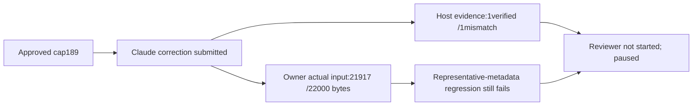

# Conductor correction189 result - 2026-09-19

**Incomplete; candidate not integrated.** User explicitly approved ceiling189 for one Claude
correction and one independent Codex review, then stop. The authorized grant was applied and
Claude submitted candidate f571809146f12d05d5262b79b1e76cc8633c985f on741fd68. The existing evidence
gate refused the failed required test before the independent reviewer could start. No second
Claude attempt or model retry was made. Calls187->188/189; one review slot remains unused.

| Measurement | Observed result |
|---|---|
| Operation | research-program-005-delivery-fix; failed:evidence_gate_refused |
| Worker | a9ae275a-ad0f-5ba7-acc8-bdd28dfdfaf2; succeeded as a submitted execution, not accepted implementation |
| Inspection | 044b3dd30a75de9a433ee8571da34993454fcaf6233598c4b30baecf8e3d0d25;2claims,1checked,1verified_mismatch |
| Worker reported tests |94passed/1failed; lint passed; unfinished gap disclosed |
| Owner Windows short-root focused suite |94passed/1failed; conductor complete-prompt fixture exceeds budget |
| Owner lint / candidate checkout |passed / clean |
| Independent model review |not started; pending decision retired by existing operation finalization |
| Owner independent disposition |withhold candidate: required test and complete delivery criterion still fail |
| Calls / stop |188/189; fleet paused; active lanes0 |
| Containers |no worker/verifier remains; existing service containers retained |

## What improved, and what remains

Using the original run003 task data through the candidate Executor._run/compiler with explicitly
injected memory/Git/isolation metadata and a no-model recording runtime:

| Role | Required serialized bytes | Limit | Outcome |
|---|---:|---:|---|
|research_lead|16743|22000|recording runtime reached|
|improvement_lead|20021|22000|recording runtime reached|
|conductor|21917|22000|recording runtime reached;83bytes headroom|

All original inputs remained unchanged. These are owner no-model delivery checks, not a real
successful conductor, review, live program or timing improvement. Reproduction paths/identities
contribute to byte totals. Earlier23377-byte conductor reproduction and this21917-byte reproduction
also use slightly different artifact-root lengths; do not attribute the entire difference solely
to source edits.

The new synthetic regression adds representative isolation, reader/checkout paths and a projection
at least17819bytes. It still refuses the complete required prompt. The worker left it failing rather
than weakening the test, and the host's test-evidence gate stopped the operation. The first owner
Windows run used an overly deep basetemp and hit known filesystem path limits in three cases; that
run is preserved as a diagnostic, not the delivery verdict. One short-root rerun reached the intended
boundary and reproduced94passed/1failed. No source was changed between those checks.

## Same-frame revision: one remaining delivery shape

Repeated cosmetic reductions have insufficient predictable headroom. Keep the complete inline
meeting payload, all findings and digests, but define ONE council-specific reader descriptor:
external_context.ref + reader_argv_prefix, with exact pointer operation arrays already present in
council_delivery.not_inline. The separately derivable external_context.file and generic duplicate
index/page/search recipes are not needed again for this known pointer-delivery path. Preserve safe
argv composition, next_cursor continuation, output bounds and access to the complete original
artifact. All other task/review/recovery readers keep existing behavior.

This is a proposed bounded correction, not implemented or proven by these results. The deciding
checks remain the complete compiled-prompt regression with representative metadata, exact retained
input replay, source/critical finding/unknown preservation, actual pointer reads and genuinely
oversized pre-provider refusal. No larger context/time budget, semantic trimming or gate bypass.
The role split remains Claude implementation / Codex independent acceptance. No further provider
execution is included in this completed one-attempt correction. No merge, deployment, reconciliation
or seven-stage live run occurred. PR153 stays draft and issue152 open.

## Raw evidence hashes

Local evidence on D is not uploaded by this manifest. Hashes bind content, not acceptance.

| File | SHA256 |
|---|---|
| `D:/workspaces/zeus/artifacts/research-program-001/conductor-delivery/correction/prepared.json` | `7ff51455d45f9ffb31f91473107a5091ae5cc4fd54d7ceb8bb988adee57fac66` |
| `D:/workspaces/zeus/artifacts/research-program-001/conductor-delivery/correction/operation.json` | `2d020b20d9513fc365e3a2623ae51e20a262a72df290ac29a3ee6eadf7da0120` |
| `D:/workspaces/zeus/artifacts/research-program-001/conductor-delivery/correction/result.json` | `3f748ea1894e113ac2896112e01aadb991d45382717b7ccdc3a814908b6c2842` |
| `D:/workspaces/zeus/artifacts/research-program-001/conductor-delivery/correction/actual-executor-check.json` | `eb1ff5cb206c763908c78a487621eda2f85a08fb43fde173fbf0dc1572299141` |
| `D:/workspaces/zeus/artifacts/research-program-001/conductor-delivery/correction/check-actual-executor.py` | `40ade726116c21ff2034089a10e847867405fefbb2f51298546b5c2aa258152a` |
| `D:/workspaces/zeus/artifacts/research-program-001/conductor-delivery/correction/owner-focused.log` | `43145fcb842f19f145c56ea5f23a50299dd5583c922e382dde6c477c44bc21d1` |
| `D:/workspaces/zeus/artifacts/research-program-001/conductor-delivery/correction/owner-focused-short.log` | `543fc09df61f1d85b0a4de132db82c17a73bd80e640b612fc850caf55b2331d7` |
| `D:/workspaces/zeus/artifacts/research-program-001/conductor-delivery/correction/owner-lint.log` | `82b3e6a6c090a57601d22943bd23fca9218d1031dbe5a7b754092f9a156b4f18` |
| `D:/workspaces/zeus/artifacts/research-program-001/conductor-delivery/correction/stopped.json` | `4756bba028c2bdee87c02e93df59f44858d458d7c1aefe098a9c542ca7facc20` |
