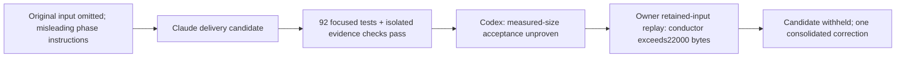

# Conductor delivery review001 - 2026-09-19

**Rejected; no candidate code integrated.** The user continuation authorized the scoped correction.
One actual Claude implementation and one independent Codex review used185->187/187. Fleet paused.
No further provider calls, new live program, reconciliation, merge or deployment were performed.

Candidate643bf6a96493c9b32c4b5b8a6a5f278b952fc78e on base43ceab5bf354994d1f75059767bcdd160536c5f5.
Operation research-program-004-delivery, worker efb11b3c-a780-5fd9-aa08-e955165c40d8.
Independent review c75cd1a0-4bc0-4084-b0a5-5d3f64b11503 succeeded with accepted=false.
Host inspection965e2215363dbd8f5ea5d9af3ccf5c856ca4a4b6f745507e83e53b4a996db94f verified both claims.
Owner Windows focused tests:92 passed; ruff passed; checkout remains clean. Full suite/CI not run for
this rejected candidate. Tests passing does not override the unmet actual-input criterion.

## One consolidated finding

P1 for the fixed acceptance condition: current conductor delivery still does not fit the unchanged
context compiler budget. Input data are the real retained run003 task values, not invented findings.
The owner used the actual candidate Executor._run and compile_context, with explicitly injected
memory store, clean Git facade, retained isolation metadata and a no-model runtime. The first two
roles reach the recording runtime; the conductor refuses before it. No provider was called.

| Role | Original task bytes | Complete required bytes in this reproduction | Limit | Outcome |
|---|---:|---:|---:|---|
|research_lead|18066|17916|22000|Recording runtime reached|
|improvement_lead|27567|21194|22000|Recording runtime reached|
|conductor|32119|23377|22000|Required contract exceeds budget; no runtime entry|

Exact byte totals include reproduction paths/identities; real production paths may differ. A separate
reconstruction of the original persisted context also refuses (required body23127 bytes before outer
packet metadata). Both methods preserve original raw bytes and task data. The original projection's
17819 bytes excludes delivery wrappers, role instructions, isolation summaries, artifact handles and
other mandatory fields; this was the design estimate's missing denominator. The worker's fixture only
asserted whole task >22000 and projection <22000, and omitted representative isolation metadata.
The independent reviewer flagged missing proof; owner evidence establishes the actual refusal.

The candidate correctly preserves raw authority, pointers, fail-closed overflow and stage-specific
restrictions. Its timeout/retry/snapshot contracts remain unchanged. These accepted findings stand;
there is no reason to reopen unrelated program or deployment work.

## Revised same-batch handoff

Keep all meeting content and findings unchanged. Reduce repetitive instructions and redundant
non-authoritative metadata, not the data, digest checks or global budget. Pre-implementation roles do
not need a full worker container configuration repeated as if one had run. Carry only meaningful
phase constraints/identity references. Avoid repeating identical conductor directions in multiple
required blocks; keep exact safe reader argv boundaries and all source handles.

The deciding regression is the COMPLETE compiled prompt with representative isolation/reader/path
metadata and a canonical projection of at least17819 bytes, not only the projected dictionary. Verify
all three roles, unchanged raw references, critical findings, unknowns, Unicode, source immutability,
reader pointers, candidate-review control and pre-provider refusal for genuinely oversized content.
Owner then repeats check-actual-executor.py against the same preserved input. No live-latency claim,
extra context/time allowance, dropped findings, consumer relaxation or silent source summarization.

Next batch needs two additional authorized starts for Claude correction and independent Codex review.
They are not available under187. A new seven-stage live run is separate and not included in that pair.
Old conductor pending_reconciliation stays intact. PR153 remains draft; issue152 remains open.

## Sources and local evidence

Official App Server documentation, opened2026-09-19:
https://developers.openai.com/ko-KR/docs/app-server documents turn/completed as the terminal event.
It does not establish Zeus's local300-second policy or the cause of this timeout. Local source and
retained artifacts establish the findings above; no model/version/global configuration was changed.

Raw evidence is on D; hashes bind exact files and do not upload their contents:

| File | SHA256 |
|---|---|
| `D:/workspaces/zeus/artifacts/research-program-001/conductor-delivery/diagnosis.json` | `23d123d4f310de797e4e25a370c4362ff6d0cdd579ed148f92f8813419c8c96c` |
| `D:/workspaces/zeus/artifacts/research-program-001/conductor-delivery/operation.json` | `d6ad1b2237854e42e1999ae276a4f12d0883f491a6af6b064c7b0e93f3f28e51` |
| `D:/workspaces/zeus/artifacts/research-program-001/conductor-delivery/prepared.json` | `17691a9c38dc60abc47b16ef41457f49bda1d87e17eb24f4e32e1933d37238ab` |
| `D:/workspaces/zeus/artifacts/research-program-001/conductor-delivery/worker.json` | `e58b630b63eead845ffd458e3530fd2a7d5150cac0add46ca0647e10b9f7249d` |
| `D:/workspaces/zeus/artifacts/research-program-001/conductor-delivery/review.json` | `160659860f2b91dffd539ef600e8df241968342fda09e905954646ed90bb091c` |
| `D:/workspaces/zeus/artifacts/research-program-001/conductor-delivery/result.json` | `767e02a4e088322502ded4d554f561daecd3a069a80563da5d85ffa9db880176` |
| `D:/workspaces/zeus/artifacts/research-program-001/conductor-delivery/actual-input-check.json` | `69175a701bc8e9bcf38d55cb19d3e8152c6276974b947aa286bc21afc9c45408` |
| `D:/workspaces/zeus/artifacts/research-program-001/conductor-delivery/actual-executor-check.json` | `c865d6f1c22d86d64d9b8f441a17d3aea38e691fadf90f15b1fadad927375356` |
| `D:/workspaces/zeus/artifacts/research-program-001/conductor-delivery/check-actual-executor.py` | `3cc7d52e426ce233a292b6009712d0cf535e2dff38c92af21f583dfaaba97d3a` |
