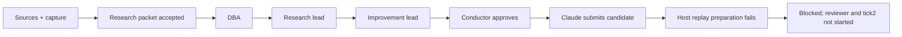

# Second authorized live attempt — 2026-09-19

**Stopped at evidence replay preparation. Overall live acceptance remains incomplete.**
The user granted ceiling181 only after CI success, for one new attempt, then stop. No merge,
deployment, automatic retry, third collection tick or budget extension occurred.

| Measurement | Observed result |
|---|---|
| Runtime base / CI | f1edf72f1029a6f421d7b92785f0cc8962918a4e; CI35372344181 success |
| Program / council | research-live-002 / research-live-002.c001 |
| Calls | 174 ->180 of181; six starts, one unused slot |
| Research, DBA, two leads, conductor | all five actual role executions succeeded |
| Earlier packet failure | new research packet passed the unchanged consumer contract |
| Claude | actual isolated execution succeeded and submitted a candidate |
| Host evidence replay | two claims, zero checked; both replay_failed, before container creation |
| Independent reviewer / tick2 | neither started |
| Final state | programblocked; councilfailed; operationfailed: evidence_gate_refused |
| Fleet / cleanup | paused; active lanes0; no worker/verifier container remains |
| Exact token scan | zero matches, zero unreadable files within the bounded artifact scan |

The operation's `adoptions.dispatched` count is an attempt count, not verified adoption or release.
Claude reported21 tests passed/1 skipped and lint passed. The host could not independently replay
either command, so these remain worker-reported results, not accepted verification.

## Failure evidence and limits

Both replay findings say `isolated_replay_unavailable: FileNotFoundError`, returncode null,
duration0. Their lifecycle records have `container: null`, only the refused transition and no
prepared transition. This locates the failure before container creation in host preparation;
it does not show pytest or lint failing inside a container. The retained error type does not
identify the missing path or prove why it was missing. No filesystem cause is asserted here.

Inspection: `28b1b942bfff0dd71041f634aec07496b801ac2d238daa7ebf0f116abe1784d4`.
Replay IDs: `1dac880e87ac429d82db25e206cbcfa6`, `70855f31e0f84878b1b3a16e86fe50f8`.
Candidate: `d491e1de50a412fc1d2da1dac55fc99ab0d97f5e` (not independently accepted or merged).
Capture: `19f09cc50f79605921b223f2e01459a18113d65e`.

The candidate recommendation remains in its local worker checkout under
`D:/workspaces/zeus/artifacts/research-program-001/run002/live/workspaces/3b9d8631-52b7-5de6-9b59-ec3dab545499`.
It is evidence of a submitted artifact, not a reviewed improvement. The prior failed run is intact.

The interval is measured from cycle completion. The owner launcher therefore schedules two
single-tick CLI invocations, waiting the configured interval only if tick1 is accepted. This run
failed before that condition, so no second invocation occurred. This demonstrates the finite
owner launcher and actual council path up to evidence preparation, not a deployed recurring service.

## Next bounded boundary

Investigate snapshot preparation in `adapters/isolated_evidence.py::_replay` using the retained
candidate and filesystem evidence, without another model call. Distinguish missing source,
destination/path handling and concurrent deletion before choosing a fix. Preserve the failed
inspection; do not promote the worker's self-report or replay it silently. Any later implementation
and fresh live run need their own bounded acceptance. The separate diagnostic-log recovery residual
also remains. Issue152 and draft PR153 stay open.

Hashes and local evidence locations are in EVIDENCE-002.md. No additional calls are scheduled.
