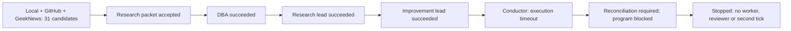

# Third authorized live attempt - 2026-09-19

**The bounded verification stopped at conductor timeout; full-path acceptance remains incomplete.**
The user authorized ceiling187 (+6), after pinned CI success, for one attempt with at most two
collection ticks and one council, then stop regardless of outcome. No retry, merge or deployment.

| Acceptance / measurement | Actual result |
|---|---|
| Source head / CI | 1a0e9bfdd1deb25971636dc187b46e5328a37b7d; CI35379964168 success before grant/start |
| Program / council | research-live-003 / research-live-003.c001 |
| Runtime | D:/workspaces/zeus/artifacts/rp004; prepared projected snapshot maximum235 characters |
| Calls | 180 ->185 of187; five starts, two unused slots |
| Collection | local, GitHub and GeekNews all ok;31 discovered,10 eligible,20 ignored,1 selected |
| Selected lead / capture | baldrix-common-notes /44047f05ba8ee8557565457aa67ca69dd3a5986f |
| Research, DBA, two leads | four executor-bound succeeded outputs |
| Conductor | task blocked; reconciliation_required after execution time budget exceeded |
| Claude worker / evidence replay / independent reviewer | not started |
| Second collection | not started because the first council was not accepted |
| Terminal state | council failed:role_blocked; program blocked:council_failed |
| Fleet / cleanup | paused; active lanes0; no worker/verifier container remains |
| Exact credential scan | zero exact-token hits, zero unreadable files in the bounded launcher scan |

The program reports one completed cycle. That means the cycle received a terminal failed result,
not that the council or overall acceptance passed. Only existing service containers remained:
flexday-pg, zeus-local-ops-redis and zeus-ticket-ledger. They were not removed.

## What the failure establishes

Conductor task `1a2c202d-a29d-5d76-bb54-4dbdf97e457d`, attempt1, records
`PostExecutionRecordFailure: transport failed after provider entry (ContractError: Codex turn execution budget exceeded)`.
The app-server adapter emits that ContractError when its execution deadline expires. This is a
local execution-time limit, not evidence of a provider subscription quota error or global call-cap
exhaustion. The latter still had two slots. No completed conductor result was durably accepted.

Termination record `4e3d3daf09b91b190b4fbd17fb79f29eee2148cd3c228d91f2fdac2d86e1ece8`
records boundary transport, invocation_outcome unknown and pending_reconciliation. The task,
termination and program records are preserved unchanged. No operator reconciliation, task repair,
resume or automatic retry was performed. A fresh run is not authorized by the two unused slots.

We have not established why the conductor took longer than its limit. The supplied multi-role
context is a possible contributor, not a proven cause. This attempt did not reach container replay,
so it neither re-tests nor invalidates the earlier accepted short-root recovery verification.
The old failed runs and the separate diagnostic-log recovery limitation remain intact.

## Remaining, without expanding this run

The required success criterion still is one accepted complete seven-role council, followed by the
second real collection with no additional adoption/model calls and configured termination.
A future bounded design should first inspect the retained conductor input and execution evidence,
then decide whether to reduce its required input/output or alter a role-specific time allocation.
Do not increase time/call limits or start another run merely to obtain green. Resolve any required
reconciliation explicitly before reusing the blocked task. No such follow-up was executed here.

Raw evidence and SHA256 references: [EVIDENCE-003.md](EVIDENCE-003.md). PR153 remains draft and
issue152 open. This is a completed authorized test attempt with a failed acceptance result, not an
unattended-ready declaration.
