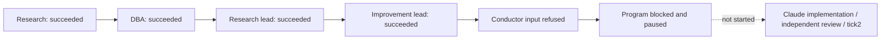

# Research live004: stopped before conductor provider entry

2026-09-19. Runtime 7a27b3fe105b4e025ff073d1745fcf4f79f11581; capture/base
6e1a69c114464976cbaff954b95936b7ab280474. PR153 remains draft/open. No merge/deploy.

## Accepted changes and their limits

- Complete-input correction passed owner96 focused tests and the old run003 no-model replay
  (20777/22000 bytes). That establishes only those inputs, not all valid future meeting outputs.
- Subscription accounting passed owner177 focused tests/8 skipped; full suite2184 passed/455 skipped.
  Final runtime CI at7a27b3f passed Windows/Linux and integration. The earlier console-pytest import
  failure was fixed by the actual Zeus Claude worker, independently accepted by the Zeus Codex reviewer.
- That subscription operation advanced the same usage ledger192->194 with no numeric grant. The actual
  Claude receipt has accounting_mode=subscription, max_budget_usd=null and no dollar-cap flag.
  Usage is observed, not remaining subscription allowance or billing. Provider quota failures still stop.
- New pinned worker image368a7b9aefc5d8ac87109257eb83460dade1004d737ab3e4cb50cb3fc6350a8c
  uses Claude CLI2.1.274. Existing Fleet service remains paused; global service migration is not claimed.

## Actual failure and one discriminating check

Four actual roles succeeded. Conductor task d552756e-37e8-589d-8018-51ec68836f52 failed before
provider entry: `ContractError: Required contract exceeds budget; split task`.
The frozen snapshot was still fresh; this was not the previous300-second model timeout.

Current raw task is35114 bytes. Lossless inline delivery alone is20751 bytes, including packet11871,
research proposal2666 and improvement proposal3085. Owner replay of this exact raw artifact through
Executor/compiler measured complete required context23055/22000 bytes, unchanged source, provider
not entered. Replay uses injected store/Git/isolation metadata and a no-model runtime; the actual PG
failure independently establishes that the live input was refused. No claim of exact live byte count.

The assumption that advisory compaction ensures variable meeting data fits is invalid. Another small
word reduction is not an accepted complete design. The next batch must establish a producer-to-consumer
size contract or a verified lossless paged delivery path, with this input and the old retained inputs.

## Stop, evidence and remaining acceptance

Five slots reserved/settled194->199; four successful provider executions. Slot count is not model-call
count. No implementation, verifier, candidate promotion or second tick occurred in this cycle. Program
blocked, Fleet paused/active0. No worker container remained; existing service containers were retained.
Exact saved-token scan found0 hits with0 unreadable artifacts (not a general secret-leak guarantee).

Raw evidence stays on D, bound by EVIDENCE-004.json. No failing PG record was rewritten. No extra live
retry was made. Remaining launch acceptance: complete variable-input delivery, one accepted seven-stage
cycle, second bounded collection and termination. Local full-asset absorption and project observability
remain operational project queues using existing analysis/Fleet SSOT, not additional launch gates.
