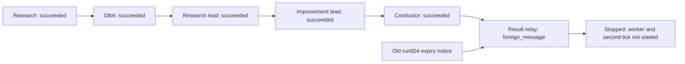

# Actual run006: input policy accepted, foreign informational notice blocked relay

Runtime f93aea2847a168f3dea5d38f8987bbcba3ff64c9. No automatic merge/deploy or retry.

The v2 input change passed independent Zeus Codex review, owner118 focused tests,2259 full tests
(455 skipped), lint, four actual retained-input no-model replays and the original live005 proposal
replay. Linux/Windows3.12/3.14 and integration CI passed attempt1; docs was intentionally skipped.
It also passed the live path through all five meeting roles. Do not conflate this with full acceptance.

At the conductor relay, Redis entry1789798392671-0 was an execution.notice for old run004's expired
conductor task, not the current result. Its PG notice and outbox transport receipt prove origin;
the rejection observation proves why current006 stopped. Original notice retained with SHA256
975522eb51b3fa13f2ce866fc0a0f63f1d2fb98fa7a54e112cf1342c6f5a8753.
The same envelope reproduces foreign_message in a labelled memory-store/transport replay with real
application delivery. No source modification, task creation, decision creation or model call.

Bounded result:5 calls207->212; first cycle failed; second not started; program blocked;
Fleet paused/active0; no worker container; exact-token scan0/unreadable0. The failure is retained.

Implementation014 in the SAME SPEC owns the remaining boundary: accept only authenticated,
durably proven informational notices across correlations, commit receipt before ACK, no workflow
or promotion authority, at both council and local-cycle consumers. Foreign commands/results stay
protected. This is not a general concurrent multi-project transport claim. Old run006 is not retried.
