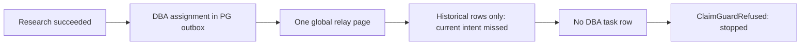

# Actual007: current assignment was not published

Runtime9892d49; all required CI attempt1.014 independent review accepted, owner75passed4skipped
focused/2277passed455skipped full/lint. Actual006 notice before/after replay passed without creating work.

Observed:108 outbox rows; DBA assignment30e16b8a-f1f9-5c38-9faf-5d30d5a459ad sent=false,
no delivery row, no task, empty DBA stream. Synthetic108-row real relay+claim-guard replay confirms
that a nonempty later global page excludes an earlier newly queued target. This is not provider failure.
One researcher succeeded; counted slots214->216 include pre-claim reservation, not two model completions.
First cycle failed, no second tick, program blocked/Fleet paused/active0, no worker container.

Implementation015 in the SAME SPEC replaces the invalid global-batch completion assumption with explicit
current-correlation publication across assignment/result/operation seams and pre-reservation admission.
It preserves accepted input/notice evidence, default background relay and atomic claim guards. No production
queue cleanup or retry of007. Not claimed: indexed large-database scalability or general concurrent project
routing. Full-cycle/tick2 acceptance remains pending.

## Implementation015 provider stop

Zeus attempted the consolidated scoped-publication specification once. Claude read source but returned
`is_error=true`: "You've reached your Fable limit. Switch to another model to continue."
No changed files, candidate, or independent review; task finalized, container removed. One counted slot
216->217, settled. This is an actual subscription model limit, not Zeus's legacy numeric call ceiling.
Do not claim015 is implemented. No alternate model, paid API auth, repeated call or another live canary.
Next: the same fixed015 specification after model availability is established. Full-cycle/tick2 acceptance
and operating-service migration remain uncompleted; no automatic merge/deploy or issue closure.
