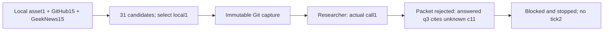

# Finite research program — actual attempt, 2026-09-19

**Stopped after a failed packet check. The seven-stage path and two-tick acceptance did not finish.**
PR #153 remains draft; issue #152 remains open. No merge, deployment or automatic retry.

| Check | Actual result |
|---|---|
| Authorized ceiling | 176 ->178, grant00000005 |
| Machine calls | 171 ->172; remaining6, no further run scheduled |
| Sources | local1, GitHub Trending15, GeekNews15, all fetched/read successfully |
| Candidate ledger | 31 new; 11 eligible; 20 ignored; 1 selected |
| Capture | c63c303f3d3069f882325851dc9a5c15f946b0a8 |
| Research execution | succeeded; its packet failed semantic validation |
| DBA/leads/conductor/Claude/reviewer | not started |
| Program | blocked; cycle1 recorded; tick2 not run |
| Fleet | paused; active lanes0 |
| Containers | no remaining worker; existing PG/Redis and unrelated flexday-pg preserved |
| Exact credential scan | 0 hits, 0 unreadable files in the runner's bounded artifact scan |
| CI | run35363033521 succeeded on954399c; Windows/Linux and integration passed |

The researcher labelled question `q3` answered while citing claim `c11` as unknown. The packet
contract rejects this relationship. Replaying the pure validator over the original, hash-bound
execution artifact reproduced the same `PacketError`, without another model call. We did not
rewrite the answer, mark the question resolved or interpret successful execution as valid research.

Execution artifact: `sha256:8e4f8990accc7a927f1b262229bfcdc4c2c48b499e0da51b177f992579e83069`.
Capture bytes: `sha256:56440fca63be2805fe62ee806681302bf65744872f63d256778a894c58ade4a1`.
Source fetch and candidate selection do not establish completed asset absorption or improved code.

## Remaining acceptance

The next bounded implementation should align researcher output guidance with the existing semantic
packet contract, then validate the complete path in a separately authorized attempt. Do not weaken
the validator or repair role answers outside their execution evidence. The prior diagnostic-log
failure reporting/recovery limitation also remains; it was not triggered in this run. No evidence
here establishes general unattended readiness.

Raw evidence is under `D:/workspaces/zeus/artifacts/research-program-001/`, with hashes in
`EVIDENCE.json`: grant, immutable input, runtime receipt/status, authoritative PG records,
packet diagnosis and unchanged runtime report. General/development/operations event counts are
recorded in the manifest summary; these categories do not by themselves prove exhaustive logging.

Preparation history: PowerShell wrote the grant receipt as UTF16; the first launcher preflight
stopped decoding it before registration/provider use. The local receipt was converted to UTF8,
then the single actual attempt above began. This was a local preparation failure, not a model retry.

## Subsequent authorized correction, not a second canary

The user then authorized continuation. Claude implemented the bounded producer-alignment batch;
independent Codex accepted candidate `fbde62db2f37ab43eacb9054a97c4a67a91652b9`. Local schema
constraints now require nonempty citations for answered questions and nonblocking unknowns;
researcher guidance explicitly covers cross-claim semantics and honest uncertainty. The consumer
validator remains unchanged, and the old invalid relationship still fails. See PACKET-ALIGNMENT.md.

Owner Windows/isolated PostgreSQL checks:103passed; lintpassed. Calls172->174/178; fleetpaused.
The two extra calls were implementation and review, not a replay of the failed researcher.
No evidence yet shows that a new live model output follows the guidance. The original failed
attempt above, remaining diagnostic limitation, and no-merge/no-deploy status all remain valid.

## Latest actual result

The separately authorized second attempt passed research, DBA, both leads and conductor, and Claude
submitted a candidate. Host evidence replay preparation then failed before container creation;
the independent reviewer and second tick did not start. Calls180/181; fleetpaused; no retry,
merge or deployment. See [RESULT-002.md](RESULT-002.md) for the actual boundary and evidence.
