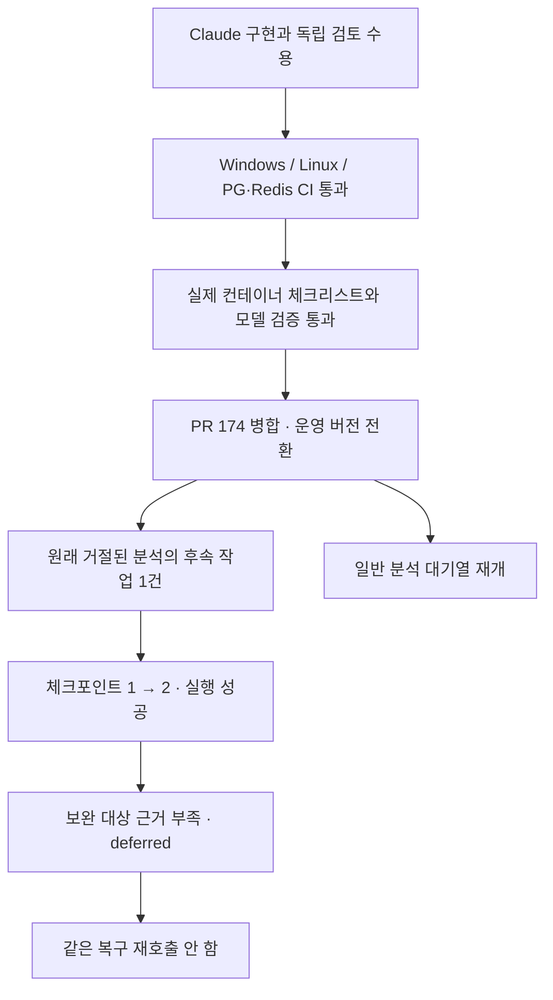

# 체크리스트 운영 반영과 실제 분석 재개 — 2026-09-21

**운영 반영과 분석 재개는 완료했다. 원래 보완 대상 1건의 의미 분석은 아직 미완료다.**
PR #174를 병합하고 `runtime-174`, 커밋 `c54441d575353af26c0c6c0c3748f0518464935f`로
Fleet·관제·창구·수집 서비스를 전환했다. 원본 분석 서비스도 같은 버전으로 재개했다.
전체 로컬 자산 흡수나 모든 오류의 자동 복구가 끝났다는 뜻은 아니다.

## 무엇을 검증했는가

| 확인 | 실제 결과 | 확인하지 않은 것 |
|---|---|---|
| 독립 검토 | 후보 `310b8e1`, decision `c5735302-672b-4f9e-93a9-2fe81011d8ce` 수용 | 전체 원본 저장소 분석 완료 |
| 최종 PR CI | run `35574577179`, head `87f25ea`, attempt 1 성공 | 모든 PC/기기 환경 |
| 런타임 CI | run `35573794517`: Windows 각 2908 passed/477 skipped, Linux 각 2923/462, 통합 3358/27 | skip된 검사 실행 |
| 실제 Docker 검사 | 합성 작업자 관측을 실제 컨테이너에서 2회 재실행, 모두 성공 | 이 첫 검사는 모델 실행이 아님 |
| 실제 구현·검토 | `checklist-live-canary-001`: Claude Opus 5 구현, 고정 check ID, 실제 재실행, Codex 독립 검토 수용 | Code Tutor 제품 인수 |
| 해당 실행 수집 | 58개 관측 수집, 실패·손상·거절 0, 최종 미정리 실행 0 | 전체 운영 로그의 무손실 보증 |
| 이미지 소스 | 연구 이미지와 Claude 이미지 각각 소스 232개가 수용된 커밋과 일치 | 설치된 모든 외부 의존성의 독립 감사 |
| 연구 CLI | 새 연구 이미지의 실제 CLI 시작 및 파일 작업 통과 | 원본 프로젝트 테스트 실행 |
| 원래 분석 재개 | Redis 발행·수신, 실제 모델, PG 체크포인트 1→2, 실행 succeeded | 보완 대상 해결: 아래와 같이 deferred |

최종 문서 커밋과 병합 커밋은 검토된 런타임의 소스·테스트·의존성·이미지 정의와 동일함을
비교했다. 기존 호스트 v1 및 프로필 없는 작업은 그대로다. **컨테이너 체크리스트는 프로젝트별로
명시적으로 선택하는 기능이며 모든 기존 작업에 전역 적용한 것은 아니다.**

## 실패도 보존했다

- Windows 로컬 전체 검사: **2893 passed, 481 skipped, 11 failed**. 운영자가 선택한 긴 임시
  경로에 테스트 내부 경로가 더해져 파일 생성이 실패했다. 짧은 D scratch 경로에서 두 모듈
  **92개가 통과**했고, JUnit 대조로 원래 실패한 11개가 모두 포함됨을 확인했다. 제품 코드와
  단언을 바꾸지 않았으며 전체 검사를 한 번에 통과했다고 기록하지 않는다.
- 첫 배포 준비는 Fleet 프로세스가 이미 없어 설정 변경 전에 거절됐다. 이전 Fleet은
  16:58 KST에 exit 1, 프로세스 정리 완료를 기록했다. 기존 실행기가 CLI 출력을 버렸으므로
  원인은 미확정이다. 진행 작업이 없고 예약 작업이 Ready임을 확인한 뒤 두 번째 배포에서
  재기동했다. 새 Fleet의 Running 상태를 확인했지만 과거 종료 원인을 고쳤다고 주장하지 않는다.
- 원본 읽기 작업 `6bdee495-dc50-4701-8a7b-8806962b3bea`는 모델이 제안한
  `docs/rfc/verdict-gate-evidential-force.md`가 고정 manifest에 없어 거절됐다. 명령 4개 중
  나머지 3개는 일반 파일이었다. 원본 실패와 파티션·schedule을 보존하고 기존 Workflow의
  운영자 취소 경로로 해당 시도만 종결했다. 같은 입력을 재호출하거나 성공으로 바꾸지 않았다.

## 실제 보완 작업의 정확한 판정

- 원래 작업: `c54b7b10-4a8e-4a9b-97e8-a5f9a298c6ed`.
- 후속 작업: `3ce497fd-847a-4b1a-8fed-11688640f305`, 첫 실행 succeeded.
- 보완 계보: `repair-7060ac4a2494fd0d6cd935fa`.
- 내용 판정: `analysis_checkpointed`; 보완 판정: **deferred / no_corrected_subsystem**.
- 대상 1개, 보완 0개, 잔여 1개. distribution의 로더·패키징·참조 자원·실행 경로를 충분히
  확인하지 못해 해당 분석을 null로 남겼다. 실행하지 않은 테스트도 실행했다고 주장하지 않았다.
- 파티션 generation은 1→2. 하위 시스템 14개와 질문 6개가 남았다. 원본 거절 기록은 그대로다.
- 수집은 실행 종료 시 66개, 후속 정산 4개이며 양쪽 모두 수집 실패·손상·거절 0이다.

이 검증은 운영자가 원래 보완 대상 **1개를 선택**하여 기존 잠금·활성화 관문·Redis 전달·실행
권한 확인·모델·정산을 사용했다. 일반 대기 배정 55개보다 보완을 자동 우선 배정한다는 증거는
아니다. 보완 opt-in은 검증 후 비활성화했다. 정상 분석은 숨김 실행기의 기존 대기열에서
재개됐으며, 다음 실제 작업 `92e0dada-ae90-45a0-91c4-54c5173b3c3f`가 관제 API에서 running으로
관측됐다. 이 상태는 관측 시점의 사실이고 앞으로의 완료를 보증하지 않는다.

## 잔여와 다음 판단

1. distribution의 누락된 구현·테스트 근거를 확보해야 원래 보완 대상을 완료할 수 있다.
   현재 deferred를 repaired로 바꾸거나 같은 보완을 무조건 세 번째 호출하지 않는다.
2. manifest 밖 경로를 제안한 계획의 복구는 의미 분석의 tests 누락 보완과 다른 유형이다.
   해당 진단과 실행 증거를 사용해 별도 수용 기준을 확정한 뒤 처리한다.
3. 과거 Fleet 종료 원인은 미확정이다. 재발 시 CLI 실패 내용을 보존할 수 있는 실행기 로그
   개선이 후속 관측 항목이다. 현재 재기동 성공을 원인 해결 근거로 쓰지 않는다.

기존 연구 프로그램은 자신의 고정된 기반 버전과 설정을 유지한다. 실행 중인 프로그램의
명세나 원장을 이번 배포에 맞춰 소급 변경하지 않았다. 이슈 #20은 전체 운영 잔여가 있어 닫지 않는다.

## 증거 위치와 복구

대용량 원본은 `D:/workspaces/zeus/artifacts/self-improvement-reference-001/`에 보존한다.
Git에는 이 요약과 식별자만 둔다. 아래 원본은 이 PC의 로컬 증거이며 원격에서 내려받을 수
있다는 주장은 하지 않는다.

- `checklist-owner-acceptance.json`, `checklist-pr-ci.json`
- `owner-checklist-310b8e1.xml`, `owner-council-shortpath-001.xml`, `owner-checklist-test-reconciliation.json`
- `checklist-image-verification.json`, `checklist-container-canary-001/receipt.json`
- `checklist-live-canary-001/{receipt,stdout}.json`, `checklist-release-canary-001/receipt.json`
- `checklist-release-activation-001/receipt.json`, `checklist-deployment-002/receipt.json`
- `repair-live-canary-001/receipt.json`, `unknown-path-diagnosis-001.json`, `unknown-path-owner-disposition.json`

Claude 이미지: `sha256:df85b10cdfb4e744e81d466d6ed747e6f9ee1398b29f01dab456989e9c635cfa`.
연구 이미지: `sha256:53ee28ab6630d1175fefc297777ed58f4e7c727848bc6b7be3af3ea4c5147165`.
활성 release: `9be7b56213bce8327bc6c547725e16ecec3608d3daa43dab8226101bb340681f`.
이전 `runtime-173`, 이미지, 설정 사본을 유지했다. 롤백은 신규 배정을 멈추고 기존 release
rollback/activation 절차로 시행해야 하며 파일 경로만 되돌려 완료했다고 판단하면 안 된다.
