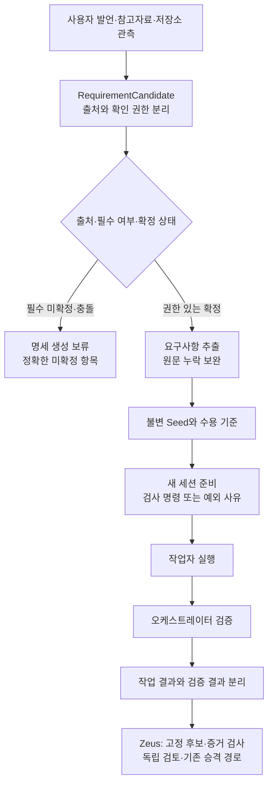

# 요구사항 → 실행 계약 → 검증: 흡수 설계 입력

2026-09-20. 기존 SPEC의 첫 기능 경로 분석. 상태: **소스 추적 및 Zeus 기준 검사 완료, 전체 경로 실증·구현 인계 전**.
Upstream pin은 SOURCES.json과 같다. 아래 줄 번호는 그 커밋 기준이다.

## 연결한 경로

화살표는 아래 코드 연결을 설명한다. 전체 upstream 실행을 수행한 그림은 아니며,
마지막 Zeus 연결은 **이식 방향**이다. 병렬 작업 정산·프로세스 회수·DB commit 전체 추적은 남아 있다.

## 사실과 한계

| 경계 | 직접 읽은 근거 | 확인한 동작 / 한계 |
|---|---|---|
| 출처와 권한 | `core/requirement_candidate.py:25–192,291–440` | 출처는 user/reference/model/repo, 확정 상태와 권한은 별도 축. 참고자료를 사용자가 확인해도 출처를 user로 바꾸지 않는다. `confirm_by_user`는 값 변환 함수이며 사용자 인증 구현이 아니다. |
| 후보 승격 | 같은 파일 `evaluate_promotion` | 근거 연결 누락·필수 unknown은 block, 선택 미확정은 omit, 충돌은 block. repo 근거만으로 확정 가능한 것은 context/existing_constraint이며 제품 수용 기준에는 user 권한을 요구한다. Zeus에는 기존 위임 범위를 적용해야 하므로 매 기술 판단마다 새 사용자 승인을 요구하는 정책으로 복사하지 않는다. |
| 모델 추출 누락 | `bigbang/requirement_distillation.py:270–413`, `bigbang/seed_generator.py:1627–1845` | 생성 함수가 명세 생성 전 후보 정책을 적용한다. 원문 anchor는 사용자 확정 제약·수용 기준의 누락을 보완한다. 일반 경로와 reference-aware 경로는 다르며 모든 추론 문장을 일괄 필터한다고 주장하지 않는다. |
| 모호성 점수 | `seed_generator.py:1660–1705` | 첫 생성에 score gate가 있고 force는 그 gate를 우회한다. 실제 score/force가 metadata에 남는다. 차세대 reflect 경로는 별도다. 이 점수는 사람이 요구를 충분히 정의했다는 실증이 아니다. |
| 수용 기준 구조 | `core/seed.py:515–721` | description, semantic key, verify command, expected artifacts, output assertion, 검사 예외 사유가 분리된다. 명령과 예외 사유는 함께 선언할 수 없다. 아티팩트는 workspace-relative 경로 검증을 호출한다. 해당 경로 검사 함수 자체의 전체 플랫폼 검증은 미완료. |
| 프롬프트 | `core/seed_contract_prompt.py:1–184`, `runner.py:550–630` | 기존 코드 맥락·제약·온톨로지·종료 조건을 구성한다. auto recursion guard는 문자열이며 그 자체를 실행 차단 훅으로 세지 않는다. runner에서 계약 렌더 호출을 확인했다. |
| 새 세션 gate | `core/seed_verify_gate.py:1–84`, `runner.py:8503–8620` | 명령도 예외 사유도 없는 기준을 모아 새 세션 준비 시 warn 또는 block한다. 설정 읽기 실패는 warn이다. Zeus의 필수 검사 거절 규칙을 이 fallback으로 약화시키지 않는다. |
| 기계 검증 | `parallel_executor.py:9684–9977` | 산출물 존재, POSIX shell 명령 종료 코드, 출력 부분문자열을 확인한다. 명령 실행 실패/timeout은 검증 불가로 구분한다. 이 파일의 13,125줄 중 해당 함수들을 읽은 것이며 모든 실행 분기를 읽은 것은 아니다. |
| 동시 작업 | 같은 파일 `9731–9773`, `verify_gate_outcome.py:101–229,317–346` | 형제 작업 중 workspace 변경은 replay_required로 표시한다. 캐시 결과는 최종 경계에서 산출물 존재를 다시 확인한다. 최종 settlement 실행/원장 원자성은 아직 검증하지 않았다. |
| 검증 불가 | `verify_quarantine.py:1–77` | 기존 worker 결과를 보존하고 unverified 이벤트와 검증 결과를 추가한다. 검증 인프라 실패만으로 구현을 다시 호출하지 않는 분리 방식이 흡수 후보다. downstream 성공 집계가 모두 이를 보존하는지는 미확인. |

## Zeus와의 대응 및 결정

| 흡수 후보 | Zeus SSOT | 결정 |
|---|---|---|
| 원문→확정 기준의 추적 | `domain/frontdesk.py`의 상담 결과, `domain/sdd.py::validate_spec`, `application/sdd.py::register` | **고도화 후보**: 기존 요청/명세 ID에 출처·결정 근거를 연결. 새 Seed 저장소를 만들지 않는다. 현재 읽은 스키마에는 항목별 origin/confirmation 축이 없다. 저장소 전체에 동일 기능이 없다고 단정하지 않는다. |
| 고정 검사 계약 | `domain/project_evidence.py::parse_profile,observed_checks` | **재사용**: host가 선언한 argv/context/expected_exit와 필수 검사 분모를 유지한다. upstream의 임의 bash 명령을 그대로 도입하지 않는다. |
| 후보·환경 결속 | `application/evidence_inspection.py` | **재사용**: task/generation/attempt/candidate/policy/environment/interpreter 결속과 트랜잭션 내부 소유권 검사를 유지한다. |
| 실행·검증·수용 분리 | `application/operation.py::evidence_gate,_accepted`, `application/promotion.py` | **재사용 + 관제 고도화 후보**: 미확인 검증을 accepted로 올리지 않는다. 이미 성공한 구현을 검증 인프라 문제 때문에 다시 구현시키지 않을 재개 계약이 필요한지는 기존 recovery 경로와 추가 대조한다. |
| 제품 사용자 인수 | `domain/sdd.py`, `application/sdd.py::request_advance` | **별도 제품 트랙**: 현재 이 함수는 blocked를 반환하는 준비 기능이다. SDD 8단계가 이미 자동 운영된다고 보고하면 안 된다. 하네스 자체 개선 수용을 실기기/사람 인수에 종속시키지 않는다. |

### 기능을 넣을 위치

- Domain: 출처·권한·필수/선택·확정 상태에 대한 순수 판단. 저장/모델/네트워크 호출 없음.
- Application: 기존 요청·명세·실행 ID와 연결, 불변 결정 이력, 멱등성 및 소유권 검사.
- Adapter: 현재 artifact/PG/Redis와 관제 투영. 저장된 원문과 후보에 대한 접근은 기존 경로 사용.
- Prompt/profile: 이미 확정된 결과의 작은 투영만 전달. 프롬프트 텍스트를 권한의 원장으로 삼지 않음.
- Upstream enum/클래스를 통째로 vendoring하지 않고, 기존 Zeus 계약에 필요한 의미를 이식.

## 첫 구현 묶음 후보의 수용 조건

범위 후보는 **요청에서 확정 명세까지의 출처 추적**이다. 복구팀·watchdog·새 DB·제품 배포까지 한 PR에 섞지 않는다.
아직 아래 연결 조사를 마치지 않았으므로 Claude에 실행 명세로 보내지 않았다.

| 경우 | 요구 결과 |
|---|---|
| 정상 | 사용자/기존 위임 근거 → 기준 ID → 명세 digest → 실행 manifest가 끊기지 않음 |
| 모델 추론·참고자료 | 사용자 발언으로 출처를 바꾸지 않음; 채택 결정과 원래 출처 병기 |
| 명시 요구 누락·의미 변경 | 동일 기준 ID의 뜻을 몰래 바꾸지 않음; 새 버전 또는 명시적 대체 |
| 필수 unknown·충돌 | 해당 범위만 보류; 질문/결정이 필요한 정확한 항목 제시 |
| 선택 항목·경미한 편차 | 비도입/보류 사유를 보존하며 무관한 구현은 진행 가능 |
| 중복·재시작·동시 작성 | 같은 결정은 재생, 다른 결정/낡은 버전은 충돌; 하나의 확정 head |
| 취소·기한 | 미확정 초안이 실행 권한이 되지 않음; 기존 기한 유지 |
| 검증 unavailable | 실행 사실 보존, 검증 상태 별도; 배포/지식 승격 권한 없음 |
| 플랫폼·정리 | 기존 상대경로·artifact 보존 계약 사용; 새 프로세스/정리기 도입하지 않음 |
| 로그·관제 | 결정 이유 코드와 기준/명세/실행 ID 제공; 원문·비밀값을 무분별하게 노출하지 않음 |

### 인계 경계의 추가 확인

- `application/frontdesk.py`는 상담 요청을 저장하고 상담 작업을 outbox에 넣는다.
  이 경로의 objective/evidence는 구현을 배정하지 않는다고 명시하며, 답변의 acceptance_criteria는 대화 내용이다.
  따라서 프런트데스크 모델 답변을 실행 권한으로 간주하는 연결을 만들면 안 된다.
- `application/tickets.py:154–192`는 ticket revision/content hash를 확인하고,
  선택적인 goal/criterion 결속 후 `conductor → lead:improvement` 계획 메시지를 같은 트랜잭션의 outbox에 넣는다.
  `org.authorize` 호출이 있으며, ticket의 claimed_author 문자열은 사람 인증이 아니다.
- `domain/operation.py::validate_plan`은 objective/acceptance_criteria/allowed_paths의 닫힌 스키마다.
  출처 필드를 임의로 주입하지 않고, 기존 manifest의 버전·결속 계약을 따라야 한다.
- `adapters/ticket_authority.py`에서 읽은 서명 정책 부분은 별도 trust commit을 쓰는 외부 인수 경로다.
  이것을 모든 기술 설계에 사람 서명이 필요한 경로로 확대하지 않는다.

따라서 구현 위치는 상담 응답 생성기가 아니라 **소유자가 요청을 고정된 ticket/plan으로 만드는 경계**가 적절하다.
기존 위임 근거의 기계 검증과 criterion별 출처를 저장하는 확장 방식은 아직 설계 잔여다.
이것을 모델이 적은 `confirmed=true`로 대체하지 않는다.
우르보로스의 나머지 전체 분석은 COVERAGE에 그대로 열려 있다.

## 실제 검증과 미실행

Zeus 현재 체크아웃에서 기존 `tests/test_sdd.py tests/test_project_evidence.py` 실행:
**54 passed, 8 skipped**, exit 0, pytest 20.57초. skip은 PG 통합 환경 7건과 호스트 symlink 권한 1건이다.
테스트는 계약/임시 파일·실제 자식 프로세스 검사이며, 실제 모델·실기기·PG 운영 검증이 아니다.
영수증 `D:/workspaces/zeus/artifacts/self-improvement-reference-001/baseline-001.json`;
로그 SHA256 `b87f88738f121bf917622449569d4f4bb3a65220b2afa9e82273d51549bb20ad`.

Upstream 테스트는 읽기만 했다:
`test_seed_verify_gate.py` 전체, `test_requirement_candidate.py:110–296`,
`test_requirement_distillation.py:406–465`. 모델 응답 mock이 있는 테스트를 실제 모델 실측으로 취급하지 않았다.
소스 읽기 도우미의 Windows cp949 출력 오류를 UTF-8 출력으로 수정해 필요한 구간을 다시 읽었다.
가짜 product failure나 upstream 결함으로 집계하지 않는다.

전체 탐색용 AST 색인은 Python 파일 1,413개/776,809줄/정의 35,262개를 파싱했다(구문 파싱 오류 0).
이것은 탐색 보조이며 의미 분석 완료나 실행 호환성 검증이 아니다.
색인 SHA256 `b48bc685db0775be77c923780ebfaa7338afffa95c9b4f7fc83964930c2be11e`.

## 고정 출처

- [후보 출처와 승격 정책](https://github.com/Q00/ouroboros/blob/f0e17b4b42cc06974f2afaf15606250939cd4f87/src/ouroboros/core/requirement_candidate.py)
- [명세 생성 연결](https://github.com/Q00/ouroboros/blob/f0e17b4b42cc06974f2afaf15606250939cd4f87/src/ouroboros/bigbang/seed_generator.py)
- [실행 후 검증 연결](https://github.com/Q00/ouroboros/blob/f0e17b4b42cc06974f2afaf15606250939cd4f87/src/ouroboros/orchestrator/parallel_executor.py)
