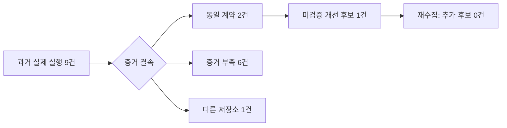

# 판단 피드백 운영 검증과 사용 안내

2026-09-22. 기존 SPEC의 owner delivery를 이어간다. 목표는 검토된 #177 병합,
수집·보고의 사용 경로 정리, 첫 후보의 재사용/확장/신규 판단이다.
새 스케줄러·모델 호출·자동 재시도·정책 변경·Fleet 교체는 이번 범위에 없다.

## 확인한 결과

PR #177은 Windows/Linux 및 통합 CI를 통과하고
`292e22808d3d8246eee3d15fd4a30c4508fcbe31`로 병합됐다.



동일 계약의 실행 2건은 성공 1건과 실패 1건이다. 결과만으로 지휘자 판단의 옳고 그름을
판정하지 않는다. 후보는 `needs_analysis`, 판단 품질은 `unknown`이다.

| 검사 | 실측 |
|---|---|
| 최초 Windows 검사 | 실제 PG 포함 31 passed / 1 failed / 0 skipped |
| 실패 원인 | 테스트가 executable Git mode를 복원하지 않아 다음 JSON 검사 전에 거절됨 |
| 수정과 검토 | Claude가 테스트 한 파일 수정, 독립 Codex 검토 수용 |
| 최종 Windows 검사 | 실제 일회용 PostgreSQL 포함 **32 passed / 0 skipped, 17.80s**, Ruff 통과 |
| 정리 | 검사 DB 삭제, 최초 실패 산출물 보존 |
| 원본 보호 | 관련 906행을 후보 schema에 복사. 수집 전후 원본과 복사본 해시 동일 |
| 과거 증거 | 실제 artifact 10개 해시 검증 후 C에 보존. event 참조 3개는 찾지 못함 |
| 수집 | scanned 9, eligible 2, unknown 6, foreign 1, candidate 1, conflict 0 |
| 재수집 | 동일 collection ID, unchanged observations 2, 추가 후보 0 |
| 실제 CLI | 후보 schema의 status/report 각각 exit 0 |
| PR CI | [35694775729](https://github.com/trevi00/zeus/actions/runs/35694775729): Windows/Linux 3.12·3.14, integration, CI gate 통과. docs는 경로 정책에 따라 skip |

증거 부족은 세션 결속 불충분 1건, 실행 artifact 미확인 1건, 판단 event 결속 불충분
4건이다. 원본 실행·작업·정책·검증 그래프를 수정하거나 증거 부족을 성공으로 바꾸지 않았다.
과거 스냅샷 검사이며 현재 동시 실행을 입증하지 않는다. 원본은 삭제하지 않았다.

## 운영자가 사용하는 경로

정의는 Git, 실행 기록은 PostgreSQL, 실행 본문은 해시 검증된 artifact가 소유한다.
수집은 이를 연결해 미검증 후보만 기록한다. Codex가 비교 기준과 수용을 판단하고,
코드 변경이 필요한 경우에만 Claude에게 명세를 배정한다.

이 PC의 코드 경로는 `C:/workspaces/zeus/worktrees/decision-feedback-recovered`이며,
Python은 `C:/Users/rudtn/zeus/.venv/Scripts/python.exe`를 사용한다.
운영 Fleet은 별도 `runtime-pg-cli-001`을 계속 사용한다. Git 병합은 서비스 교체가 아니다.

```text
python -B -m zeus --repository <repository> decision-feedback status
python -B -m zeus --repository <repository> decision-feedback report --collection <collection-id>
python -B -m zeus --repository <repository> decision-feedback collect --registry <tracked-path> --revision <40-hex-commit> --limit 100
```

조회 환경은 `PYTHONPATH=<code>/src`, `PYTHONDONTWRITEBYTECODE=1`,
DB 연결은 기존 home 설정을 메모리에서 읽고 `search_path=zeus_feedback_owner_20260922,public`로
한정한다. 이 후보 schema는 원본 기록의 복사본과 이번 수집 결과이며 운영 public이 아니다.
DSN/인증값을 명령행이나 보고서에 출력하지 않는다. 이 PC 전용 조회 파일과 영수증:
`C:/workspaces/zeus/artifacts/storage-recovery-001/feedback-report-merged.py`,
`feedback-merged-cli-receipt.json`. 조회 파일은 기존 CLI를 호출하는 owner 도구이며 스케줄러가 아니다.

현재 collection ID:
`collection:79d2dc3fc9f25c20819ed2c9ab88e4f35fa6406b8fa0ecca0c9d3c099ddd5727`.

새 collect는 registry와 repository identity, 원본 DB/실행 artifact 경로를 확인한 뒤 한 번씩
실행한다. 기존 registry는 과거 `D:/workspaces/zeus/worktrees/fleet-001` identity를 가리킨다.
C checkout에서 그대로 사용해도 동일 저장소로 간주되지 않는다. 파일 이동만으로 동등성을
꾸미지 않고 새 사용 범위에 맞는 registry를 owner가 Git에 고정한다. 잘린 페이지는
`next_cursor`로 이어가며, 실패/unknown을 없는 데이터나 성공으로 바꾸지 않는다.

## 첫 후보: 기존 흐름 재사용

후보 ID: `candidate:684119fb1782f18061a99e3172cc8902f517126aacdb43f8c7f9f7fc43971934`.
절차는 `research-live-recommendation`: 기존 조사 결과로 제한된 문서 제안 하나를 작성·검증한다.
판정은 **reuse**이며, 이번 조사에서 extend/build가 필요한 기능 차이는 입증되지 않았다.

| 대안 | 판단과 근거 |
|---|---|
| 기존 흐름 재사용 | 채택. `adapters/research_program.py`가 capture→manifest→Council→권위 있는 run 결과 조회를 연결한다 |
| 기존 코드 확장 | 기능 gap이 확인되지 않아 구현 배정 없음. 실제 다음 요구가 기존 계약으로 충족되지 않을 때 재검토 |
| 새 자동화 엔진/스킬 | 기존 책임을 중복한다. 이 두 실행만으로 새 판단 정책·스킬의 필요성이나 효과는 입증되지 않음 |

검토 기준 코드는 병합 revision이다. adapter가 council을 호출한 뒤
`domain/research_program.py::council_result`가 run ID/manifest/terminal 상태를 검증하고,
`application/research_program.py::record_council_result`가 결과를 기록한다.
실패/unknown이면 프로그램을 차단하고 기존 claim을 유지한다. 분류 판단이 이 소유권을
덮어쓰거나 재실행을 승인하지 않는다.

실제 DB 관측:

- `research-live-006.c001`: `failed`, `foreign_message`.
- `research-live-008.c001`: `accepted`, `promoted`.

이 코드만으로 정확한 과거 원인이나 지휘자 판단 오류를 확정하지 않는다. 현재
`application/autonomous.py`에는 외부 실행 메시지 거절과 일부 알림의 별도 처리 경계가 있고,
`tests/test_council.py`에는 외부 실행 메시지 거절 검사가 있다. 그 존재가 과거 실패의 재현을
뜻하지는 않는다. 이번에는 해당 테스트를 새로 실행하지 않았으며 코드 추적과 #177 CI를 구분한다.

동일 계약 반복은 검토 후보의 근거다. 성공 하나와 실패 하나가 동일 오류 두 번이라는 뜻은
아니므로 2-strike 실패 자동 수리를 시작하지 않는다. PG 후보는 `needs_analysis`,
`verified=false`를 유지한다. 이 문서는 owner 분류 근거이며 검증 지식 승격이 아니다.

## 증거와 전달 경계

- 독립 수용 런타임 후보: `4f2dcf130efbb78b87ba501df1101ef2fcdc7dcf`.
- 테스트 수정 후보: `6385ab2b5072056beaf33c3446571c9817de62ef`.
- 최종 PR head: `4e41183e2eac82249369c9fe12fae25e7d404a0e`.
- 영수증 위치: `C:/workspaces/zeus/artifacts/storage-recovery-001/`.
- 파일: `feedback-historical-result.json`, `feedback-pg-tests.log`, `feedback-pg-final.json`,
  `feedback-pg-final.log`, `feedback-cli-status.json`, `feedback-cli-report.json`.
- 해시: `DECISION-FEEDBACK-OWNER-EVIDENCE.json`.
- 검사 registry revision: `09c9cbd94f728629c61e6c76f8eabaf8e404f5d9`.

초기 보고서의 한글이 PowerShell 파이프 전송 과정에서 물음표로 저장된 것을 발견해 복구했다.
원본 JSON/검사 로그와 해시는 유지한다.

완료 기준은 정확한 head의 CI 후 병합, 병합 코드의 실제 조회, 첫 후보의 기존 소유자·대안·한계
기록이다. 원본 보존과 멱등성은 기존 수용 결과를 유지한다. 이번 문서/읽기 작업에 timeout,
동시성, 플랫폼, 정리의 새 런타임 변경은 없다. 상시 수집·웹 후보 표시·판단 정책 개선은 별도
범위이며 실제 기능 gap 없이 후보 수를 줄이기 위한 구현을 만들지 않는다.
