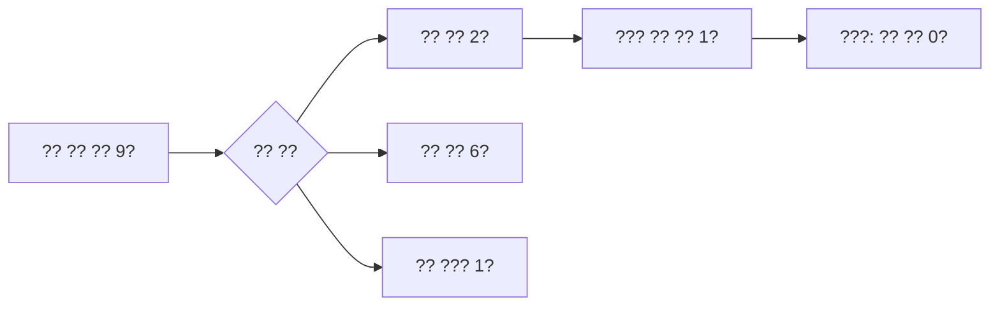

# ?? ??? ?? ??

2026-09-22. ?? ?? ?? `4f2dcf130efbb78b87ba501df1101ef2fcdc7dcf`. ?? SPEC? ????? 1? ??? ????. ?? ?? ???? ?? ??? ???? ???.

?? ??? ?? ?? 2?? ?? 1?? ?? 1???. ????? ??? ??? ?? ??? ???? ???. ?? ??? `needs_analysis`, ?? ??? `unknown`??.

| ?? | ?? |
|---|---|
| ?? PG ?? ?? ??? | 31 ???1 ???skip 0. PG ???/?? ??? ?? |
| Windows ?? | ???? executable Git mode? ???? ?? JSON ?? ?? ???. Claude? ??? ? ??? ?? ?? |
| ?? ?? | public? ?? 906?? ?? ?? schema? ??. ?? ?? ??? ??? ?? ?? |
| ?? ?? | ?? ?? artifact 10?? ?? ?? ? C? ??. ?? ?? event ?? 3?? ?? ?? |
| ?? | scanned 9, eligible 2, unknown 6, foreign 1, candidate 1, conflict 0 |
| ??? | ?? collection ID, unchanged observations 2, ? ?? 0 |
| ?? CLI | ?? ?? schema?? status/report ?? exit 0 |

?? ??? ?? ?? ??? 1?, ?? artifact ??? 1?, ?? event ?? ??? 4???. ??? ?? ?? ???? ???? ?? ??????????? ???? ??? ???.

??? identity? ?? ?? `D:/workspaces/zeus/worktrees/fleet-001`? digest? ????. owner Git? ??? registry? ??? ????? ??? ????. ?? ?? ??? ???? ?? ?? ??? ???? ???. ??? ???? ???.

CI???? ???? ?? ????. ?? Fleet ???? ?? PG CLI ???? ????.

## ?? ??

`C:/workspaces/zeus/artifacts/storage-recovery-001/feedback-historical-result.json`
`C:/workspaces/zeus/artifacts/storage-recovery-001/feedback-pg-tests.log`
`C:/workspaces/zeus/artifacts/storage-recovery-001/feedback-cli-status.json`
`C:/workspaces/zeus/artifacts/storage-recovery-001/feedback-cli-report.json`

?? PG schema: `zeus_feedback_owner_20260922`. Git registry revision: `09c9cbd94f728629c61e6c76f8eabaf8e404f5d9`.
