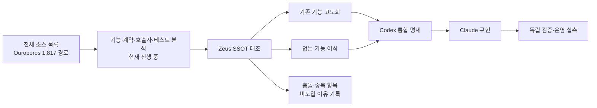
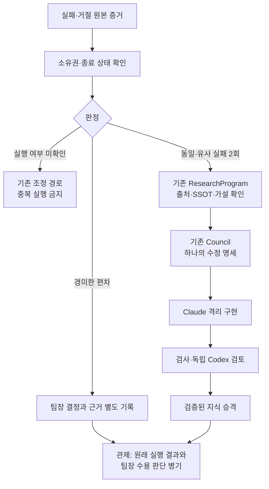

# 세 저장소 흡수 조사 — 첫 코드 분석 기록

2026-09-20 · Codex 분석 · **진행 중, 구현 인계 전**

## 현재 결론

우르보로스 전체를 검토하되, Zeus에 두 번째 실행기·DB·검토 권한을 덧붙이는 방식은 피한다.
현재 읽은 코드에서 우선 흡수 후보는 고정된 목표/수용 기준, 단계별 평가,
활동과 진척의 분리, 작은 결과 봉투와 별도 증거 저장, 원인별 복구 조건이다.
후보를 발견한 것과 실제 실행 경로를 검증한 것은 다르다. 아래 판단은 설계 입력이며 운영 검증 결과가 아니다.

## 범위와 증거

- Ouroboros: `f0e17b4b42cc06974f2afaf15606250939cd4f87`, 전체 1,817 경로를 113개 구조 분류로 배정했다.
- Hermes Agent: `59f9ff8dbc75b9c4f07ae10174df730f7882a505`, 전체 14,403 경로 목록 확보. 이번 의미 분석 범위는 경험/복구 관련 경로다.
- Oh My Hermes: `24108bc70e319295663cef60cdb44fed58705d28`, 전체 2,614 경로 목록 확보. 이번 의미 분석 범위는 경험/복구 관련 경로다.
- Zeus 비교 기준: `1382f734352c22282844a18fbe9c2e9fcb57afa7`.
- 전체 목록은 커밋·blob·크기·모드를 보존한다. `SOURCES.json`은 D 드라이브 원장 경로와 해시를 고정한다.
- `COVERAGE.md`는 구조 분류표다. 소스 의미 분석 완료율이나 기능 완성률로 읽으면 안 된다.
- 소스를 설치하거나 실행하지 않았다. 테스트 파일을 읽었지만 upstream 테스트 실행은 **0건**이다.

## 확인한 구현과 Zeus 적용 판단

| 항목 | 소스에서 확인한 사실 | Zeus 적용 방향 / 남은 확인 |
|---|---|---|
| 고정 실행 계약 | `core/seed_contract.py`는 목표, 수용 기준, 제약, 온톨로지, 평가 원칙, 종료 조건을 frozen 계약으로 변환한다. runner에서 변환 호출을 찾았다. | 기존 plan/manifest/criterion을 확장한다. 별도 Seed SSOT를 만들지 않는다. Seed 생성·검증→프롬프트→판정 전체 연결은 미완료. |
| 단계별 평가 | `evaluation/pipeline.py`는 기계 검사→의미 평가→조건부 합의를 실행한다. 전달받은 공통 기계 검사 결과를 재사용할 수 있다. | 기존 evidence inspection→독립 검토를 유지한다. 재사용은 동일 candidate·환경·검사 정책 결속이 확인될 때만 허용. upstream handler의 결속은 미확인. |
| 추가 합의 조건 | `evaluation/trigger.py`는 수동 요청, 명세/온톨로지/목표 변경, drift/uncertainty, 대안 채택을 조건으로 둔다. | 기존 Council에 필요한 재논의 조건을 대응시킨다. 점수 임계값을 Zeus의 근거 없이 복사하지 않는다. |
| 독립성 표시 | `evaluation/reviewer_independence.py`는 independent/same_vendor/unavailable/unverified를 나누지만, 모델 이름을 문자열로 추정하며 quorum 유지를 위해 같은 vendor를 남길 수 있다. | '독립성 미확인' 표시는 유용하다. vendor 이름 차이를 독립 검토 증거로 대체하지 않는다. 실제 실행·세션·후보·판정 결속을 유지한다. |
| 유계 전략 전환 | `resilience/recovery.py`는 기본 1회 개입 후 stagnated를 반환한다. runner 9701–9870에서 실패한 순차 실행의 기존 runtime handle에 지시를 전달하는 연결을 읽었다. | Zeus의 두 번 반복→조사→새 명세→격리 구현에 맞게 변환한다. 조사 없이 persona 전환만 하는 것을 자가개선 완료로 기록하지 않는다. |
| 정체 감지 | `resilience/stagnation.py` 일부에서 출력/오류 반복, 진동, drift, 개선률 분류를 확인했다. 클래스 검색에서는 정의·export·테스트 외 생산 호출을 찾지 못했다. | 감지 알고리즘 후보. 전체 동적 연결 부재를 단정하지 않으며, 연결 완료로도 주장하지 않는다. 중복 이벤트가 아닌 서로 다른 attempt 기준을 유지한다. |
| 활동/진척 구분 | `evolution/material_progress.py`와 watchdog 291–375는 마지막 활동과 마지막 material event를 따로 갱신한다. auto/agent_process 분류는 비어 있다. 실패 이벤트도 material 집합에 포함된다. | 관제에서 생존, 상태 전이, 수용 기준 달성의 세 지표를 구분한다. upstream material을 곧 성공 진척으로 번역하지 않는다. |
| 작은 결과 봉투 | `core/disposable_memory.py`는 본문 없는 버전 2 결과 봉투와 크기 상수를 정의한다. | six-W에는 식별자·상태·증거 참조, 큰 원문은 artifact에 둔다. 이 파일만으로 실제 크기 제한 집행이나 보존을 증명할 수 없다. |
| 미확인 배정 복구 | `auto/handoff_contract.py`는 안정된 session id와 동일 멱등 키로 unknown handoff 1회 재시도를 선언한다. | 원격 소비자의 멱등 처리 증명 없이 Zeus unknown 작업을 재실행시키지 않는다. starter와 원장 연결 추적이 필요하다. |
| 복구 계획과 실행 구분 | `auto/recovery_plan.py`는 QA 이후 계획을 직렬화한다. 계획 생성 자체는 dispatch가 아니다. | proposed/authorized/dispatched/verified/resolved를 혼합하지 않는 방향으로 기존 조사 상태에 연결한다. |
| Hermes 경험→스킬 | `agent/learn_prompt.py`는 기존 스킬 확인 후 갱신, 큰 자료의 참조 분리, 출처 취급 규칙을 프롬프트에 넣는다. | 컨텍스트 프로그래밍에 맞는 후보. 프롬프트 규칙을 저장 시점의 검증이나 안전한 승격 구현으로 주장하지 않는다. skill_manage 경로는 아직 미확인. |
| OMH 원인별 복구 | `src/coding/cause_recovery.py` 일부는 in-flight 표식 우선, 권한·인증·한도·자료 부재·정체별 조건을 가진 순수 계획 함수를 보인다. | 일괄 재시도 대신 원인별 사전조건 표를 채택 후보로 둔다. 표식은 생존 증명이 아니고 조건 변경은 성공 증명이 아니다. 실행 소비자는 미확인. |

## Zeus에서 이미 있는 것

새 기능으로 중복 구현하면 안 되는 경로를 직접 확인했다.

1. `application/council.py`의 `_pipeline`: 연구 packet 고정 → 읽기 전용 snapshot → DBA 해석 → 연구팀장 제안 → 고도화팀장 제안 → 지휘자 판단 → 기존 구현/승격 경로.
2. `domain/council.py`: reuse/improve/migrate/new 판단, improve/migrate의 compatibility/rollback/retirement 요구.
3. `application/autonomous.py`: critical-only 규칙이 이미 있다. 따라서 '경미한 지적은 차단하지 않는다'를 새 프롬프트 한 줄로 중복 추가하는 것이 답은 아니다.
4. `domain/research_investigations.py`: 서로 다른 scoped job의 반복 증상을 조사 후보로 삼고, 원인·해결·승격으로 간주하지 않는다. 프로그램 간 claim을 위한 식별자를 만든다. 이번 읽기만으로 DB 동시성 실행을 재검증한 것은 아니다.
5. `application/promotion.py`: 같은 트랜잭션에서 그래프/영수증을 쓰고 동일 graph 재전달과 충돌을 구분한다. 호출자가 증거를 검증했다는 사전조건이 있으므로 함수 단독으로 모든 결속을 보장한다고 말하지 않는다.
6. `application/portfolio.py::follow_up`: accepted 후속 작업에만 실패 이력을 연결한다. 팀장 예외 수용은 이 API로 표현할 수 없다.

## 한 묶음으로 유지할 설계 방향 — 아직 구현 명세 아님

신규 상주 팀/스케줄러를 먼저 만드는 대신, 기존 팀에 **복구 책임과 명확한 인계 계약**을 배정하는 쪽이 현재 코드와 맞는다.
이 판단은 전체 분석 후 확정한다. 실행 결과를 accepted로 다시 쓰거나 owner 수용만으로 지식 승격을 우회하는 설계는 하지 않는다.
613/600자 보고서 사례는 원래 실패/거절을 보존하면서 별도의 owner 수용 결정을 표현해야 하는 실제 사례다.

## 전체 흡수를 위한 잔여

전체 경로는 COVERAGE의 113개 분류에 남아 있고 누락 없이 다음 순서로 다룬다.
① interview/PM→Seed→실행→검증의 전체 연결, ② coordinator·provider·권한·중단·복구,
③ persistence·events·진화·온톨로지·컨텍스트, ④ CLI/MCP/plugin/skills·설치·업데이트·배포,
⑤ dashboard/TUI·로그·문서·예제·테스트·Rust/TypeScript 자산.
Hermes 두 저장소의 관련 구현/호출자/테스트 분석도 이어야 통합 복구 설계를 확정할 수 있다.

Ouroboros 루트 LICENSE는 MIT임을 읽었다. 이 사실은 모든 의존성·포함 자산의 라이선스 검토 완료를 뜻하지 않는다.
코드 이식 때 원저작자 고지와 해당 파일별 출처를 보존한다.

현재 배포 변경, 모델 호출, 신규 팀 기동, GitHub 게시 또는 이슈 종료는 없다.

## 고정된 원본 링크

- [Ouroboros 소스](https://github.com/Q00/ouroboros/tree/f0e17b4b42cc06974f2afaf15606250939cd4f87/src/ouroboros)
- [Hermes learn prompt](https://github.com/NousResearch/hermes-agent/blob/59f9ff8dbc75b9c4f07ae10174df730f7882a505/agent/learn_prompt.py)
- [OMH cause recovery](https://github.com/rlaope/oh-my-hermes/blob/24108bc70e319295663cef60cdb44fed58705d28/src/coding/cause_recovery.py)
