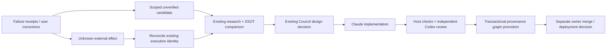

# Restart and learning promotion comparison

2026-09-20. Codex source analysis and self-crosscheck; same SPEC.md frame.
Pins are fixed in SOURCES.json. No upstream packages, scripts, tests or model calls executed.
This is an adaptation design candidate, not completed whole-repository analysis or Claude delivery.

## Decision and affected path

Keep Zeus's existing ownership and promotion boundaries. Absorb upstream classification and
context organization patterns as inputs to them, rather than installing another recovery daemon.

The diagram is a proposed integration of existing responsibilities, not proof that every arrow is
enabled in the deployed runtime. Unverified candidates may be durable audit records without being
trusted knowledge; the distinction is authority, not simply whether a row exists in PostgreSQL.

## Source-backed findings

### Ouroboros restart

- `auto/resume_routing.py` (1–36) maps named tools to retry phases; unknown tools return no phase.
- `auto/pipeline.py` (558–666) validates a persisted Seed, handles deadlines, distinguishes
  recoverable phases and reconciliable Ralph checkpoints, then persists recovery before continuing.
  Existing dispatched work can be reconciled even when the outer deadline expired.
- `auto/ralph_resume.py` (1–109) polls a known job, preserves running/blocked/cancelled distinctions,
  and refuses a checkpoint this runtime cannot poll. Its plugin branch transitions the pipeline
  to COMPLETE without proving the remote job succeeded. COMPLETE therefore cannot be translated
  directly to Zeus accepted/promoted. Its asyncio timeout is not evidence that all underlying
  resources were reclaimed; provider ownership remains a separate analysis boundary.
- `tests/unit/auto/test_interview_pipeline.py` (3279–3339) uses callbacks that raise if an existing
  handle starts a second run. This is useful contract-test source, not an executed process restart.

Candidate: resume by immutable run identity and reconcile before considering retry. Preserve
Zeus Fleet reservation and execution-generation fencing from RECOVERY-PATH.md. Do not reset a
deadline, cancel disposition or attempt history merely because the caller starts a fresh session.

### Hermes learning

- `agent/learn_prompt.py` (1–197, also inspected in the earlier tranche) builds authoring guidance:
  inventory sources, extend existing skills, separate a lean entry document from on-demand topic
  references. These are prompt instructions, not enforcement or proof of successful learning.
- `hermes_cli/cli_commands_mixin.py` (1900–1917) queues that prompt as a normal active-chat turn.
  `/learn` itself is not a deterministic distillation engine or a completed skill write.
- `tools/skill_manager_tool.py` (337–459,598–662,752–805) supplies mutation locking, write-gate
  staging/replay, atomic file replacement, security-scan rollback and advisory lint. The reviewed
  gate explicitly permits continuation if its approval module cannot be imported. Ledger capture
  is best-effort telemetry. Do not copy these semantics into Zeus's required promotion audit.
  Scanner, approval policy, batch mutation and ledger internals are not fully traced here.
- `tests/agent/test_learn_prompt.py` (46–115 inspected; earlier output was partial) checks prompt
  text and registration intent. It does not establish a real learned skill or future behavior.

Candidate: compact skill entry + attributed topic references + reuse of an existing skill owner.
Keep existing Zeus review and evidence requirements for authoritative changes. Do not adopt
Hermes's tool names, description-size rules or approval settings as universal Codex requirements.

### Oh-my-hermes candidate preparation

- `workflows/learning_candidate.py` (1–537) classifies messages into skill, memory, session-only
  or review-first candidates. Candidate cards explicitly use `prepared_not_observed`; copied
  `/learn` prompts are not creation/review evidence. Classification is token/regex heuristics.
- `routing/chat.py` (2300–2358) adds the card and selects a recommended workflow; the reason
  explicitly says preparation without running Hermes `/learn`. The word dispatch in this return
  value does not prove a downstream process ran.
- Candidate sanitization removes selected transient identifiers and truncates at 900 characters.
  It is not a general secrets filter, semantic verifier or authority check. Card identity hashes
  source/sanitized text/target, without project scope; Zeus should retain its scoped identities
  and immutable evidence links rather than replace them with this display-card identity.
- `tests/test_chat_router.py` (3400–3495) checks classification, transient-state exclusion and
  review-first cases. Read only, not executed; the inspected cases do not establish comprehensive
  secret redaction or multilingual semantic accuracy.

Candidate: separate proposed procedure, preference and temporary execution state. Preserve original
evidence in restricted receipts while placing only reusable, sanitized content in a candidate.
The model's assertion that something was observed cannot establish its evidence status.

## Zeus SSOT mapping and consolidated design choices

| Responsibility | Existing owner | Adaptation choice |
|---|---|---|
| Repeated failures | Portfolio + research investigation bridge | Two distinct bound jobs open a hypothesis; preserve scope and cross-program claim |
| Research and design | Research program + Council | Research before debate; minor recommendations do not become blockers by wording alone |
| Execution recovery | Fleet + ExecutionRecovery + fence | Reconcile unknown effect first; repair changes generation with a receipt |
| Learning candidate | Existing research input/packet boundary | Add source/scope/persistence-target distinction in the eventual versioned contract |
| Knowledge promotion | AutonomousRun._promote + promotion.promote | Retain exact task/reviewer/inspection checks and one graph/receipt transaction |
| Reusable skill package | Git definitions and existing worker profile | Extend the existing topic owner; no writes to live global skills from candidate text |
| Operational visibility | Existing portfolio/monitor projections | Show candidate, checked, promoted and deployed separately; preserve historical failures |

`domain/research_investigations.py` (1–120) makes the existing opt-in scope and untrusted symptom
family explicit. The two-strike bridge already exists; a separate team must add responsibility,
not another counter/dispatcher. `application/promotion.py` was read in full; its caller
`application/autonomous.py` (425–498) rechecks accepted execution, review and all_checked evidence.
Promotion records explicitly exclude truth of research prose, merge and deployment. Preserve this
limit when building ontology/topology: execution provenance is not proof of every learned claim.

Provisional team shape: research lead proposes; DBA reports current Git/PG state; improvement lead
evaluates material changes; conductor arbitrates; Claude implements; Codex independently reviews.
Recovery triage is a responsibility within these owners until a missing responsibility justifies
a separate role. This is a design inference, not a new running team.

## Substep review and acceptance matrix

| Substep / boundary | Result | Limit / disposition |
|---|---|---|
| Restart normal and unknown | Mapped caller, checkpoint reconciliation and test source | No upstream restart execution; no mapping COMPLETE to Zeus success |
| Candidate creation | Full candidate module + router slice inspected | Heuristic proposal only; no trust gained from matching words |
| Mutation failure / unavailable approval | Inspected gate and mutation owner | Do not adopt fail-open approval or best-effort mandatory audit |
| Concurrency / replay | Existing Zeus claim and promotion tests executed | Synthetic council/provider outputs; PG concurrent test skipped |
| Promotion failure | Existing rejection, mismatch, conflict and rollback tests executed | No live model review, learned-skill execution or deployment |
| Timeout / cancel | Source distinction between deadline and checkpoint retained | No cancellation/resource lifetime claim beyond inspected source |
| Platform / cleanup | Local Windows contract run with temporary Git/store fixtures | WSL and upstream filesystem mutation unrun; no production state touched |
| Review of claims | Facts separated from design candidates and unknowns | Codex self-crosscheck, not a separate reviewer session |

## Executed check receipt

Trusted local Python ran `pytest tests/test_autonomous.py tests/test_research_investigations.py
-q -p no:cacheprovider`, with ZEUS_/HARNESS_ variables removed, isolated D-drive basetemp and JUnit.
**25 passed, 1 skipped**, exit 0, pytest 9.33 seconds. Tests use explicitly synthetic provider,
Council and budget fixtures. This is a local contract result, not operational self-improvement.

Artifacts: `D:/workspaces/zeus/artifacts/self-improvement-reference-001/learning-001.{json,log,xml}`.
Log SHA-256: `a32aba77da6d69b75240a14adafb25b4fb29386ece3ff3b59de0a57217a04e47`.
Source emissions are recorded in `read-ranges.jsonl`; coverage credits only described read ranges.
Two guessed Zeus paths were absent; discovery located the real modules before comparison. A tool
invocation syntax error executed nothing and was corrected. Neither event is a product failure.

## Remaining analysis and handoff boundary

This closes the bounded comparison of restart routing, learning preparation and the selected
promotion boundary. Remaining: Hermes/OMH recovery execution and learning-store owners; Ouroboros
remaining capabilities and all unreviewed path dispositions; license/dependency transfer review;
one consolidated, versioned Claude implementation contract with fixed acceptance conditions.
No implementation handoff, new issue, production change or full-absorption completion is claimed.
