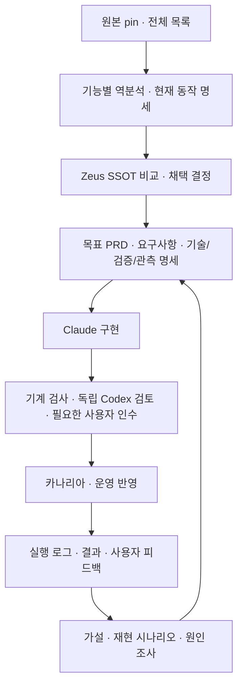

# 기능 역분석 · 명세 중심 개발 · 이벤트 기반 운영 · 증거 기반 개선

2026-09-21. 상태: Codex 정리·설계안. 구현 완료나 운영 검증을 의미하지 않는다.
작업 프레임은 SPEC.md를 유지한다. 이 문서는 그 프레임의 설계 산출물이다.
현재 immutable Claude 배정이나 운영 정책을 이 문서만으로 변경하지 않는다.

## 목표와 책임

문서 수는 제한하지 않는다. 기능 단위로 원본을 이해하고, Zeus와 비교하여 선정한 것을
명세 -> 구현 -> 독립 검증 -> 이벤트 기반 운영 -> 증거 분석 -> 명세 개선으로 완결한다.
로그는 증거의 일부이며, 다음 작업은 권한과 상태를 검사한 정책이 명령으로 배정한다.
Codex: 분석·선정·설계·수용·병합 판단. Claude: 확정 명세의 구현·테스트·증거 제출.
사용자: 실제 시나리오·제품/디자인 방향·필요한 최종 인수. 기존 권한을 매 단계 재요청하지 않는다.
전체 원본 경로 원장은 누락 관리에 유지하며, 기능별 작업 완결과 별도 지표로 관리한다.

## 기능별 산출물 지도

| 분류 | 산출물 | 주요 책임 |
|---|---|---|
| 탐색 | 기능 지도, 용어집, 시스템 경계, 의존 관계도 | 무엇을 분석하며 어떤 기능과 연결되는가 |
| 사용자 | 역할/페르소나, 사용자 여정, 핵심 시나리오 | 누가 어떤 목표와 제약을 갖는가 |
| 제품 | 복원 PRD, Zeus 목표 PRD, 범위/비목표, 성공 지표 | 원본 의도 가설과 우리가 원하는 결과 분리 |
| 요구 | 기능/비기능 요구사항, 규칙, 제약, 미확정 질문 | 검증 가능한 조건과 미확정 상태 명시 |
| 동작 | 기능 명세, 플로우차트, 시퀀스도, 상태 전이표 | 정상/거절/실패/취소/재시작/동시성/정리 경로 |
| 기술 | 아키텍처, API/메시지/스키마, 데이터·권한·소유권, 환경 명세 | 실제 구현 경계와 책임 |
| UI | 정보 구조, 화면/상호작용/상태 명세, 토큰, Storybook, 접근성 | 사용자가 실제로 보는 결과와 인수 기준 |
| 이벤트 | 이벤트 카탈로그, 정책/명령 전환표, 전달/복구 계약 | 발생한 사실에서 어떤 조건으로 다음 작업을 배정하는가 |
| 관측 | 로그/지표/추적 계약, 알림/보존 정책 | 무엇을 어떻게 관찰하고 어디까지 믿을 수 있는가 |
| 검증 | 수용 행렬, Given/When/Then, 판정 기준, 단위/통합/E2E 계획 | 성공과 실패를 외부 근거로 판정 |
| 흡수 | 원본-Zeus 차이표, 라이선스/의존성, ADR, 이행·호환 계획 | 재사용/고도화/이식/비채택/보류와 이유 |
| 운영 | 배포·카나리아·롤백·복구 런북, SLO, 장애 분석 | 운영 투입과 실패 시 행동 |
| 결과 | 실제 검증 영수증, 시각 보고서, 변경 영향·드리프트 보고 | 명세 충족과 운영 효과를 구분하여 설명 |

모든 기능에 모든 문서를 기계적으로 요구하지 않는다. UI 없는 기능의 UI 항목 등은
적용 불가와 이유를 기록한다. 해당하는 문서는 충분히 세분화하고 책임별로 유지한다.

## 증거와 권위

원본이 선언한 의도, 코드가 구현한 동작, 실제 관측된 동작, Zeus가 채택할 목표를 구분한다.
코드만으로 페르소나/사업 의도를 확정하지 않는다. 로그에 사건이 없다는 이유로 기능 부재나
안전을 단정하지 않는다. 명세·코드·로그가 충돌하면 불일치와 영향 범위를 기록한다.

기존 Git 정의, PG 실행 원장, D-drive 원본 증거, 검증 후 지식 승격 경계를 유지한다.
PG에 저장됐다는 사실은 검증된 지식이라는 뜻이 아니다. 미검증 후보도 별도 권위 상태로
지속 저장할 수 있지만 검증된 온톨로지/토폴로지와 구분한다. 그래프/문서는 출처의 대체물이 아니다.

공통 연결: capability -> persona/role -> scenario -> requirement -> contract/design ->
implementation revision -> test/assertion -> run/evidence -> acceptance -> release -> metric.
ID, 담당자, 상태, 원본 pin, 근거 ref, 미확정 사항, 개정/대체 관계를 연결한다.
Git hash 기반 영향 분석으로 바뀐 근거에 의존하는 판정을 재검토 대상으로 표시한다.
관련 없는 수용 결과는 보존한다. 같은 규칙의 정본은 한 곳이며 여러 문서는 이를 참조한다.

## 전체 흐름

DGE는 설계 -> 생성 -> 검증으로 연결한다. Debate는 고정된 topic, 원본/SSOT 조사 자료,
대안과 수용 기준 위에서 진행한다. 공격자는 구체적인 중요 조건 위반을 제시하고,
중재자는 진행/보완/보류를 판단한다. 경미한 권고로 완료 조건을 계속 늘리지 않는다.

프론트엔드의 8단계는 스펙 논의 -> 디자인 분석 -> 코드 작성 -> 자체 검증 -> 알파 배포 ->
QA/증적 -> 점진 라이브 배포 -> CS/관측이며, 결과가 다음 명세 iteration으로 돌아온다.

## 이벤트 기반 운영 계약

명령은 수행 요청, 이벤트는 이미 발생한 사실, 로그는 관측/진단이다. six-W 업무 메시지와
observation 계약을 그대로 구분한다. Redis Streams를 Kafka와 동일한 보장으로 간주하지 않는다.
이벤트 소싱이나 새로운 브로커는 이번 목표의 전제가 아니다.

현재 INV-MESSAGE-001의 at-least-once 전달, DB commit 후 ACK, 동일 ID/다른 payload 거절을
재사용한다. 필요한 상태 전환과 outbox는 같은 PG 트랜잭션으로 기록하고, 재전달에는 멱등
소비를 적용한다. 전역 순서를 가정하지 않고 동일 작업의 generation/attempt/인과관계를
검사한다. 모델이 출력한 이벤트 이름이나 성공 주장은 검증된 이벤트의 근거가 아니다.

카탈로그는 이벤트 ID/버전, 의미, 생산자, 신뢰 근거, 대상 aggregate, 선행 상태,
필수 payload, 소비자, 권한, 중복/순서 역전/만료/독성 메시지 처리와 관측 조건을 가진다.
용량/백프레셔, 소비자 재시작, 보류/재개, 메시지 스키마 호환성도 포함한다.
정책마다 이벤트 -> 조건 검사 -> 명령 또는 명시적 보류를 기록한다.

| 개념상 사건 (아직 새 wire enum 아님) | 정책 검사 | 다음 행동 |
|---|---|---|
| 분석 명세 준비됨 | 원본/범위/요구사항/근거 연결 및 Zeus 중복 확인 | 채택 판단 작업 배정 |
| 채택 결정 확정됨 | 권한, 최신 명세/기준선, 완료 조건, 실행 가능성 | Claude 구현 배정 |
| 분석 내용 거절됨 | 실제 terminal 기록, 근거 hash, 원인 분류, 보완 이력 | 허용된 보완 1회 또는 보류 |
| 같은 계열 실패 두 번 | 서로 다른 실행인지, scope/근거 확인 | 조사 요청; 원인 확정으로 오해하지 않음 |
| 검증 통과함 | 후보·명세·증거·검토 결속 | 기존 권한 범위의 수용/배포 단계로 전달 |
| 효과가 목표에 못 미침 | 유효 관측 구간·분모·명세 성공 지표 | 기존 조사/설계 경로로 환류 |

실제 구현 전에 기존 type/action/reason에 매핑한다. 새 계약이 필요한 경우 버전과 호환
전략을 명시한다. 관측 로그를 업무 메시지로 위장하거나 기존 필드의 의미를 바꾸지 않는다.

## 증거 기반 개선 계약

general/development/operations는 목적 분류이고 severity는 별도 축이다.
로그가 작업을 배정하거나 권한을 부여하지 않는다. 관측 계약과 six-W 업무 메시지를 분리한다.
기존 실행 ID·generation·attempt·correlation·causation·revision·sequence에 필요 시 명세/시나리오
참조를 결속한다. 시스템 이벤트에는 없는 실행 문맥을 만들어 넣지 않는다.
사건 시각과 수집 시각, 시작/완료/실패/미확인, 프로세스 성공과 업무 수용을 구분한다.
필수 감사의 내구성과 일반 진단의 보존/샘플링은 따로 설계한다. 비밀값·개인정보·모델의
내부 추론은 수집하지 않는다. 결정 이유 요약과 근거 ref를 남긴다.

Log -> Scenario에는 버전·환경·입력·초기 상태·순서·비결정적 의존성·기대 결과가 필요하다.
로그만으로 부족하면 추가 계측/실측부터 한다. 모델이 만든 재현 초안은 검증 전 초안이다.
실제 제품 인수/E2E에는 실제 서비스와 필요한 실기기 증거를 쓰고, 통제된 결함 주입은
결함 주입으로 표시한다. 금전·외부 변경 재현은 격리 환경에서 소유권/멱등성을 확인한다.
반복 실패 두 번은 조사 조건이지 같은 원인의 증명이 아니다. 반복 이벤트와 실제 시도를 구분한다.

## 완료와 관제

기능별로 발견/역분석/명세 확정/구현/검증/배포/효과 관측을 별도로 표시한다.
판정에는 요구사항 분모, 통과·실패·미실행·인수 대기를 표시한다. 실패 이력은 지우지 않는다.
지표: 완료 기능 수, 분석→채택→운영 전환율/시간, 성공 인수 시나리오, 근거 없는 주장,
의미 진척 없는 반복, 복구 시간/성공률/재발률, 수집 누락·지연, 완료 기능당 토큰·호출·시간.
파일/문서/호출 수는 작업량 보조 지표다. 임계값은 기준선으로 검증하고 적은 진척으로
정체가 영구적으로 가려지지 않는지 평가한다. 이번 문서로 운영 임계값을 바꾸지는 않는다.

현재 감사 observer/SDD/관측 계약은 부분 기반이다. 이 전체 흐름의 자동 실행이나 새 문서들의
자동 생성/동기화/관제 UI가 구현됐다고 주장하지 않는다. 기존 복구 후보와 실패 검증 기록은
보존하며, 통합 수용 기준을 충족하기 전 배포하지 않는다.

## 확인한 근거

- Zeus ab02a1f: docs/research-standard.md, docs/context/README.md, docs/contracts.md
  INV-OBSERVATION-001 / INV-SDD-001/002. 코드/문서 계약 확인이며 전체 운영 연결 증명은 아니다.
- 2026-09-21 열람: OpenTelemetry Logs Data Model, 사이트 OTel 1.61.0 표기, stable data model.
  https://opentelemetry.io/docs/specs/otel/logs/data-model/ — 사건/수집 시각, TraceId/SpanId,
  SeverityNumber, EventName을 별도 필드로 정의한다. Zeus에 OTel이 설치됐다는 증거는 아니다.
- 2026-09-21 열람: Cucumber Example Mapping (페이지 버전 미표기).
  https://cucumber.io/docs/bdd/example-mapping/ — 규칙, 예시, 질문을 구분하는 명세 논의 방식.
  이 방법 자체가 자동화 테스트나 실제 인수를 대신하지 않는다.

## 실행 계획: 한 기능을 처음부터 운영까지 완주

순서는 아래 하나로 고정한다. 단계별 문서 묶음은 충분히 만들되, 전 저장소 문서 완성을
첫 구현의 선행 조건으로 삼지 않는다. 관련 없는 경미한 발견은 기존 후속 원장에 남긴다.

| 단계 | 작업과 산출물 | 담당 | 통과 조건 |
|---|---|---|---|
| 0. 현재 후보 정리 | d69eaf6와 실패 원장 보존; 검증 제출 계약/실행 환경 대조; 후보 전체 명세 검토 | Codex | 재사용 가능한 변경, 실제 결함, 미검증을 구분한 수정 명세 1건 |
| 1. 기능 역명세 | 거절·복구·재개 기능의 원본/Zeus 현재 동작, 역할, PRD 초안, 요구, 상태/시퀀스, 기술/테스트 지도 | Codex | 모든 채택 주장의 근거 또는 미확인 표시, 정상/실패/재개 경계 설명 |
| 2. 목표 명세 확정 | 차이표/ADR, 목표 요구사항, 이벤트 정책, 검증/환경/관측 계약, 이행/롤백 계획 | Codex | 독립적으로 검사 가능한 완료 조건, 변경 범위, 선행 조건과 판정 근거 |
| 3. 구현·검증 | 보존 후보를 바탕으로 Claude의 보완, 고정된 체크 실행, 독립 Codex 검토, 필요한 CI | Claude + Codex | 후보/명세/테스트/검토가 같은 revision에 결속; 범위 밖 실패와 필수 실패 구분 |
| 4. 실제 운영 인수 | 작업 경계 배포, 해당 보류 건 보완·재개, 이벤트/상태/로그/산출물 대조 | Codex, 제품 인수는 사용자 | 중복 없이 실제 재개, 원본 보존, 거짓 테스트/완료 없음, 다음 작업 진행 확인 |
| 5. 확대 | 검증된 산출물 템플릿·체크·라우팅을 다른 기능/프로젝트에 적용, 관제에 기능별 연결 표시 | 기존 팀 | 충돌 없는 배정, 프로젝트별 소유권/의존성, 독립 인수와 운영 효과 추적 |

현재 후보 정리에서 같은 실패 계열이 반복됐다: 제외 지시만으로는 worker의 전체-suite
실행/제출을 막지 못했고 evidence replay가 300초에 종료됐다. 검증을 통과로 바꾸거나
시간 제한을 올려 덮지 않는다. 기존 project-evidence 계약으로 호스트가 정한 check 목록을
강제할 수 있는지 먼저 대조하고, 확인된 범위로 단일 수정안을 낸다. 이 문서는 그 해결이 아니다.

## 이번 완주 단위의 수용 행렬

| 경계 | 반드시 확인할 것 |
|---|---|
| 정상 | 요구사항 ID부터 실제 결과/운영 지표까지 연결; 모델 자기보고와 검증 구분 |
| 거절/실패 | 진단 가능성, 원본 보존, 국소 보완, 두 번째 실패 이후 조사·보류 |
| 미확인 | 읽을 수 없는 증거·미실행 테스트·제품 의도 가설은 unknown/not-run 유지 |
| 중복/역순/재시작 | 하나의 후속 작업, 최신 세대/명세 검사, commit/ACK 및 전달 응답 유실 복구 |
| 취소/기한/권한 | 중단 후 새 외부 효과 금지, 활성 작업 보존/정리, 자동 권한/한도 확대 없음 |
| 환경/정리 | Windows와 Linux CI, 현재 Windows/WSL에서 필요한 실제 경계, 소유 자원 정리 |
| 변경/배포 | 영향 받은 수용만 재검증, 명세와 코드 drift 검출, 기존 릴리스/증거 보존 |
| 제품/실기기 | 해당 기능에 필요하면 실제 인수; 이번 내부 복구 기능에는 삼성 기기 시험 불필요 |

이번 계획의 성공은 문서 수나 읽은 줄 수가 아니다. **기능 1건의 역명세 -> 채택 결정 ->
구현 -> 독립 검증 -> 실제 보류 건 재개 -> 운영 근거 보고**가 모두 연결돼야 한다.
완료 기능 수, 경계/시나리오 검증 분모, 도입 후 복구 결과를 함께 보고하며 원본 전체
흡수 완료와 혼동하지 않는다. 소규모 기능 진척 하나가 장기 정체를 숨기는 문제는 별도
관측 설계에서 평가하고, 현재 진행 중인 분석의 임계값을 임의로 바꾸지 않는다.

## 문서 배치와 에이전트 입력

기능 디렉터리에 INDEX, AS-IS, PERSONAS, PRD, REQUIREMENTS, FUNCTIONAL, TECHNICAL,
EVENTS, OBSERVABILITY, ACCEPTANCE, ADOPTION, ADR, RUNBOOK, RESULTS를 역할에 맞게
나눈다. 정본 위치/ID/출처/개정/상태는 INDEX에서 연결한다. 이 목록은 템플릿 설계이며
해당 파일이나 자동 생성기가 이미 존재한다는 뜻은 아니다.
다이어그램은 변경된 상태/계약을 같이 검토하고, 문서 링크가 있다고 런타임에 전달됐다고
간주하지 않는다. 필수 목표·수용 조건·권한은 항상 전달하고 나머지는 관련 ID를 통해
필요할 때 읽는다. 저장소 문서 총량과 한 세션의 컨텍스트 예산은 별개다.
