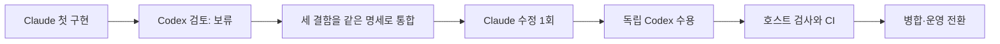

# 서비스 중지와 재시작: 운영 반영 완료

2026-09-19, Codex 독립 수용 및 운영 전환 결과입니다. [고정 명세](SPEC.md)의 완료 조건을 충족했습니다.
PR #154의 로컬 자산 개선과 [PR #155](https://github.com/trevi00/zeus/pull/155)의 서비스 소유권 수정을
같이 배포했습니다. 관제·수집 서비스는 실행 중이고, Fleet 작업 배정은 이번 작업 종료 후 일시정지 상태입니다.

**고친 문제:** 이전 운영에서 오래된 모니터 프로세스 6개와 남은 수집기 잠금을 관측했습니다.
부모만 종료하고 자식 트리를 소유하지 않는 기존 런처에서 가능한 실패 경로를 수정했습니다.
이 경로가 과거 모든 잔여 프로세스의 유일한 원인이었다고 주장하지는 않습니다.
새 런처는 기존 `ProcessTree`를 재사용하며 공급자, DB, 예산, 권한 정책은 바꾸지 않습니다.

## 실제로 확인한 결과

| 확인 | 결과 | 증명이 닿는 범위 |
|---|---|---|
| 최종 독립 Zeus Codex 검토 | 수용; 명령 주장 4/4 재검증 일치 | 지정된 후보와 명세 |
| Windows 집중 검사 | 40 통과 / POSIX 전용 5 건너뜀 | 서비스 소유권 및 기존 백그라운드 실행 경계 |
| Claude Linux 집중 검사 | 41 통과 / Windows 전용 4 건너뜀 | 컨테이너 안의 해당 검사 |
| 소유자 Windows 전체 검사 | 2,321 통과 / 460 건너뜀 | 로컬에서 실제 실행된 검사; PG 통합 통과로 대체하지 않음 |
| 최종 코드 CI | 첫 시도 성공 | Windows/Linux Python 3.12·3.14, PostgreSQL·Redis 통합; 문서 전용 잡은 의도적으로 생략 |
| 실제 임시 예약 작업 | 중지·재시작 2회 성공 | 실제 프로세스 핸들 종료, 잠금 재획득, 무관한 프로세스 생존, 자식 콘솔 핸들 0 |
| 실제 운영 수집기 | 중지·재시작 1회 성공 | 기존 5개 핸들 종료, 실제 잠금 재획득, 웹 서비스 유지, 최신 상태 게시 |
| 종료 상태 | Fleet paused/idle, 모델 컨테이너 0 | 새 작업 자동 시작 없음; 관제·로그 수집 실행 중 |
| 기존 작업 보존 | C 저장소 HEAD 및 130개 파일 해시 동일 | 보존 목록의 파일; 인증과 전역 원장은 이동하지 않음 |

실제 운영 수집기의 관제 시각은 `2026-09-19T12:19:47.339165+00:00`에서
`2026-09-19T12:19:54.473939+00:00`로 갱신됐습니다. 이 중지·재시작에는 수동 잔여 정리가 0회였습니다.
배포 자체에서는 **기존 방식으로 실행되던 서비스 프로세스 15개를 계획된 유지보수로 종료**했습니다.
그 15개를 고아 프로세스로 세거나 새 런처의 자동 회수 성과로 세지 않습니다.

## 첫 실패를 지우지 않고 수정본을 수용

첫 구현은 일반 검사와 예약 작업 시험을 통과했지만 다음 경계가 남아 보류했습니다.
열린 로그 파일을 쓰기 가능하다고 간주한 점, 마지막 로그 실패가 비정상 자식 종료 코드를 그대로
돌려준 점, POSIX 생성 반환 경계의 SIGTERM이 소유권 인계를 끊는 점입니다.
같은 명세에 세 조건을 모아 수정했고, 첫 실행과 실패 증거는 보존했습니다.

최종 반례 실험에서는 로그 쓰기 거절 시 자식 시작이 0회였고, WSL의 실제 생성 반환 시점에
주입한 SIGTERM 뒤 자식이 남지 않았습니다. 이는 **명시적으로 주입한 결함 시험**이며 과거 운영 장애
재현이라고 부르지 않습니다. 비정상 자식 종료와 마지막 로그 실패의 우선순위도 집중 검사에서 확인했습니다.

실제 Zeus 호출은 **Claude Opus 5 구현 2회 + 독립 Codex 검토 2회**입니다.
구독 모드 원장은 `229 → 233`으로 증가했고 네 호출 모두 정산됐습니다. Fable은 호출하지 않았습니다.
첫 보류 작업을 자동 재호출한 것이 아니라, 통합 보완 명세를 가진 별도 수정 작업으로 기록했습니다.
추가 모델 호출 없이 소유자 검증·병합·배포를 마쳤습니다.

## 버전과 증거

| 항목 | 고정 값 |
|---|---|
| 수용 후보 | `f9ad7de5ac5f27fe7d6a2fd10ff1c14862cbba16` |
| 후보 트리 | `c7d2a12e6a6bf75e1a920f79ed0d58446531186f` |
| 배포 병합 커밋 | `2bd77a3dabf8617dec808f3bc1cbbf100818ca05` — 후보와 트리 동일 |
| 운영 코드 | `D:/workspaces/zeus/worktrees/runtime-155` |
| 코드 CI | [35441782111, attempt 1](https://github.com/trevi00/zeus/actions/runs/35441782111) |
| 최종 예약 작업 시험 | `scheduled-37c65ef1492046bd9d72cd973d70301e` |
| 첫 작업 / 수정 작업 | `service-ownership-001` / `service-ownership-001-correction` |
| 원본 증거 루트 | `D:/workspaces/zeus/artifacts/service-ownership-001` |
| 증거 원장 | 위 루트의 `EVIDENCE.json`, 파일 64개 경로·크기·SHA-256 |
| 원장 SHA-256 | `6023cb10f6579389fb94ccea8404eb36e56ee0c141207a02b80b7a973fe1f7bd` |

주요 원본은 `correction-001/owner-validation.json`, `owner-full.xml`, `batch-receipt.json`,
`operation-receipt.json`, `final-ci.json`, `deployment.json`, `live-collector-restart.json`,
`final-state.json`입니다. 수정 작업 검사·실행 파일들은 `correction-001/` 아래에 있습니다.
원본은 D 드라이브에 보존합니다. Git의 해시 기록이 원본의 원격 다운로드 가능성을 보장하지는 않습니다.

## 남는 범위

- 재부팅·절전 검증은 수행하지 않았습니다. POSIX SIGKILL과 별도 세션으로 이탈한 자식 정리도 보장 범위 밖입니다.
- 이번 관제 확인은 HTTP 응답·PG 상태·실제 수집 갱신입니다. 웹 화면의 시각적 품질 재검토는 아닙니다.
- 로컬 하네스 전체 흡수는 아직 완료가 아닙니다. 다음 자산 작업은 별도 명세와 검증을 가진 작업으로 배정합니다.
- 폭넓은 운영 이슈 #17은 이 서비스 경계 하나를 고쳤다는 이유만으로 닫지 않습니다.

관련: [이전 자산 작업](../local-absorption-001/RESULT.md), [구현 기록](IMPLEMENTATION.md).
